# Agentic Athenaeum - Roadmap

Status: Implementation roadmap

This document is the architecture and implementation roadmap for building production-quality skills in this repository. It is aligned with the repository contract in `AGENTS.md`, `README.md`, and ADRs `0001-0003`.

## 1) Intent and Product Outcome

Agentic Athenaeum converts raw learning materials — zero or more PDFs, audio (including video), Markdown, or PPTX files — into:

- explanation deliverables (Markdown and optional PDF)
- summary deliverables (per-group and full-course)
- high-quality Anki decks (sync and/or `.apkg`)

Target user outcome: move from preparation work to learning and mastery.

## 2) Non-Negotiable Repository Constraints

These constraints are binding for all skills and workflows:

1. Source of truth is `dev/`; `skills/` is generated output only.
2. Authoring is TypeScript; distribution runtime is bundled Node.js JavaScript actions.
3. Build pipeline is `pnpm run build:skills` using `scripts/build-skills.mjs`.
4. Normal contributor PRs must not include `skills/**` changes.
5. Skill env requirements are declared in SKILL frontmatter under `metadata.env` (repository convention using the Agent Skills spec's metadata extension; see docs/setup-guide.md).
6. Shared packages are `@agentic-athenaeum/contracts` and `@agentic-athenaeum/queries`.
7. Quality gate command is `pnpm run verify`.

Design implication: every architecture choice below must remain compatible with these constraints.

## 3) Design Rationale

The roadmap emphasizes vision and breadth while tightening execution with explicit control contracts and implementation gates.

### 3.1 Strengths retained

- Clear pipeline intent (ingest -> organize -> explain -> summarize -> recall).
- Strong principle split: scripts do deterministic mechanics, agents do reasoning.
- Explicit worker/validator mindset.
- Good incremental rerun direction.

### 3.2 Key design decisions

1. **Missing run-state contract** -> add a formal run manifest and unit event model.
2. **Loose handoffs** -> add schema-bound `HandoffRequest/Response/Verdict` envelopes.
3. **Over-broad validation policy** -> add risk-tiered validation policy matrix.
4. **Weak incremental mechanics** -> add hash-based impact analysis algorithm.
5. **Insufficient observability** -> add run-level and unit-level audit schema.
6. **Roadmap too conceptual** -> add wave-based acceptance criteria and exit gates.

## 4) Operating Model

### 4.1 Brain/Hands split

- Scripts: deterministic transforms, extraction, packaging, schema checks.
- Agents: cleanup, classification, synthesis, pedagogical reasoning.

### 4.2 Deterministic State Machine orchestration

The orchestrator runs as a deterministic phase state machine. It stores state in files, not in conversational memory.

Core phase order:

1. `ingest`
2. `organize`
3. `explain`
4. `summarize`
5. `anki`

Modes:

- `full`
- `incremental`
- `rollback`
- `user-edit`

### 4.3 Context discipline (new hard rule)

Subagents receive only:

- unit payload
- step contract (`references/<step>.md`)
- minimal context brief

Subagents do not receive full pipeline history or other units.

## 5) Canonical Artifacts and Schemas

### 5.1 Content Package (required output of ingestion)

Each ingested source yields:

```text
<package>/
  content.md
  manifest.json
  assets/
  raw/
```

Manifest minimum fields:

- identity: `package_id`, `source_sha256`, `source_type`, `processing_version`
- status: `status`, `errors[]`, `warnings[]`
- provenance: processor and model/tool metadata
- structure: `sections[]` with typed `locator`
- assets: `images[]` with relevance/classification metadata

### 5.2 Group Manifest (organization output)

`groups.json` minimum contract:

- `groups[]` with stable `id`, `members[]`, `suggested_order[]`, `toc[]`
- `ungrouped[]` with reason
- `group_hash` for incremental invalidation
- `grouping_policy` with scoring weights and threshold version
- per-group `confidence` and `review_required` flags

`toc` levels are restricted to `1..3` (`#`, `##`, `###`) and IDs must be unique.

### 5.2.1 Canonical reuse surface (new hard rule)

After Phase 1, each file produces a `ContentPackage` containing `content.md`, `manifest.json`, `toc.json`, and `assets/`. These are per-file artifacts, not yet organized.

After Phase 2, the pipeline exposes one canonical reusable artifact surface:

- `OrganizedCorpus` = `groups.json` + unified ToC + organized source spans/references + per-file `toc.json` provenance

Downstream policy:

- explanation, summary, and Anki stages may reuse only `OrganizedCorpus` plus stage outputs (`ExplanationDocument`, `DistilledSummary`)
- per-file `toc.json` artifacts are consumed by Phase 2 (organization) for cross-file ToC matching; they are not valid direct inputs for Phases 3–5
- raw ingestion payloads (`raw/`, ungrouped transcripts, unsorted splits) are not valid direct inputs for downstream creation/adoption workers
- exception path: only targeted remediation during ingestion/organization rework may read raw ingestion payloads

This keeps provenance explicit and prevents downstream logic from bypassing organization decisions.

Grouping mechanism decision (default policy):

- use deterministic blocking first (explicit refs, filename/course code, date/window)
- score candidates within each block using weighted signals:
  - `0.35` explicit cross-reference links
  - `0.25` filename/sequence alignment (lecture number, chapter number)
  - `0.20` date proximity (lecture materials in same window)
  - `0.15` semantic similarity
  - `0.05` type complementarity (slides + transcript + exercises)
- auto-group when score `>= 0.75` and semantic floor `>= 0.70`
- require reviewer when score is `0.60..0.74`
- place below `0.60` into `ungrouped[]` with explicit reason code

Books vs lecture-series handling:

- books: prioritize chapter index alignment and explicit intra-book references
- lecture series: prioritize lecture number/date alignment and cross-file references
- mixed packs: require at least one hard signal (explicit ref or numbering match) before auto-group

### 5.3 Run Manifest

Each pipeline run writes a run manifest, for example `runs/<run-id>/run-manifest.json`:

```json
{
  "run_id": "run_2026-02-11_001",
  "mode": "incremental",
  "phase": "summarize",
  "status": "running",
  "created_at": "2026-02-11T15:00:00Z",
  "inputs": {
    "packages": ["pkg_a", "pkg_b"],
    "groups_hash": "sha256:..."
  },
  "changed_units": ["group-02", "group-05"],
  "units": {
    "group-02:summary": {
      "status": "failed",
      "retry_count": 1,
      "last_error": "validator_overcompressed"
    }
  },
  "warnings": [],
  "artifacts": {
    "full_summary": "outputs/full-summary.md"
  }
}
```

This keeps orchestration deterministic and restart-safe.

### 5.4 Subagent contract envelopes

### HandoffRequest

```json
{
  "metadata": {
    "run_id": "run_...",
    "trace_id": "trc_...",
    "unit_id": "group-02:section-03",
    "step": "section-cleanup",
    "contract_version": "1.0.0"
  },
  "contract": {
    "instructions_ref": "references/section-cleanup.md",
    "output_type": "markdown"
  },
  "context_brief": {
    "document_title": "Lecture 3",
    "toc_path": ".../toc.json"
  },
  "unit_payload": {
    "section_title": "Backpropagation",
    "raw_text": "..."
  }
}
```

### HandoffResponse

```json
{
  "metadata": {
    "trace_id": "trc_...",
    "unit_id": "group-02:section-03"
  },
  "status": "success",
  "artifact": {
    "schema_version": "1.0.0",
    "data": "..."
  },
  "warnings": [],
  "error": null
}
```

### ValidatorVerdict

```json
{
  "metadata": {
    "trace_id": "trc_...",
    "unit_id": "group-02:section-03"
  },
  "verdict": "fail",
  "confidence": 0.93,
  "violations": [
    {
      "rule": "no_summarization",
      "severity": "critical",
      "message": "Key derivation step omitted"
    }
  ],
  "retryable": true
}
```

Any non-conforming output is rejected by check scripts before merge.

Reviewer input scope contract (mandatory):

- reviewers receive both the produced artifact and source-linked references (`source_refs`, `source_locator` spans), not output-only context
- reviewers must evaluate:
  - omission risk (missing required concepts or ToC nodes)
  - distortion risk (contradiction with source references)
  - bloat risk (non-essential expansion)
- reviewers return a structured decision: `pass | rework | escalate` with rule-level violations

This enforces user-required "compare merged output to original context" behavior before stage progression.

### 5.5 Schema versioning and migrations

All core JSON artifacts (`manifest.json`, `groups.json`, run manifest, check reports) use explicit schema versioning:

- include `schema_version` in each artifact
- use semver policy for schema compatibility
- ship `migrateXtoY()` migration functions in `@agentic-athenaeum/contracts`
- auto-upgrade on read, write latest on save

Compatibility rules:

- patch/minor additions are backward compatible when fields are optional
- breaking shape changes require major bump and migration path
- no artifact is consumed without schema validation

This prevents contract drift as skills evolve.

Semver compatibility matrix:

| Change type                  | Version bump | Compatibility expectation | Required action                    |
| ---------------------------- | ------------ | ------------------------- | ---------------------------------- |
| add optional field           | minor        | backward compatible       | add default handling in readers    |
| tighten enum values          | major        | potentially breaking      | add migration and fail-fast checks |
| rename/remove field          | major        | breaking                  | migration required before read     |
| bug fix with no shape change | patch        | compatible                | no migration                       |

Migration strategy:

1. detect artifact `schema_version`
2. run chained migrations (`v1->v2->v3`)
3. validate against latest schema
4. write back latest canonical shape

Anti-patterns to avoid:

- unversioned JSON contracts
- silent field deletions
- embedding secrets in manifests
- shape changes without migration tests

## 6) Skill Topology

One orchestrator skill and ten pipeline/utility skills. Each supported input file type has exactly one responsible ingestion skill (orchestrator dispatches by type). Ingestion skills (IDs 1–4) each exist because they require **specific scripts and runtime dependencies**; the table below summarizes why each is a separate skill.

| ID  | Skill                   | Type          | Primary responsibility                                                                                                                                 |
| --- | ----------------------- | ------------- | ------------------------------------------------------------------------------------------------------------------------------------------------------- |
| 0   | `create-study-material` | orchestrator  | Full workflow policy, modes, re-entry, validation rules                                                                                                 |
| 1   | `pdf-ingest`            | ingestion     | PDF: extract (pages, images, structure, optional OCR), assemble, check-output; needs PyMuPDF / Tesseract.                                              |
| 2   | `media-ingest`          | ingestion     | Audio/video: prepare (normalize, chunk), transcribe, assemble; needs ffmpeg and transcription provider.                                               |
| 3   | `md-ingest`             | ingestion     | Markdown: extract (headings, frontmatter, structure), assemble; deterministic parse only, no heavy deps.                                             |
| 4   | `pptx-ingest`           | pre-ingestion | PPTX: convert to PDF (always) + extract embedded media if any (LibreOffice + ZIP); output manifest → orchestrator runs pdf-ingest on PDF and media-ingest on each extracted media (0 to M; media not guaranteed). |
| 5   | `content-organize`      | organization  | grouping, ordering, ToC creation                                                                                                                        |
| 6   | `explanation`           | study         | full educational explanation generation                                    |
| 7   | `summary`               | study         | per-group and full-course summaries                                        |
| 8   | `anki-forge`            | recall        | card extraction, quality filtering, sync/export                            |
| 9   | `image-generate`        | utility       | optional generated visuals                                                 |
| 10  | `image-edit`            | utility       | deterministic image transforms and occlusion prep                          |

## 7) Full-Run Workflow

### 7.1 Preflight

1. Validate required env vars from each skill's `metadata.env`.
2. Validate input source list (0 to N files; supported types: PDF, audio/video, Markdown, PPTX) and file readability.
3. Initialize `run-manifest.json`.

### 7.2 Phase 1 - Ingestion (per-file parallel fan-out)

The pipeline accepts 0 to N input files. Supported types: PDF, audio (including video), Markdown, and PPTX. Each file type has exactly one responsible skill; the orchestrator dispatches by type so each file gets its own subagent lane(s).

**File-type → skill dispatch:**

| Input type      | Responsible skill   | Notes                                                                                       |
| --------------- | ------------------- | ------------------------------------------------------------------------------------------- |
| **PDF**         | `pdf-ingest`   | One lane: extract → worker → reviewer → gate → ContentPackage (scripts: pages, images, structure, OCR).     |
| **Audio/Video** | `media-ingest` | One lane: prepare → transcribe → worker → reviewer → gate → ContentPackage (scripts: normalize, chunk, transcribe). |
| **Markdown**    | `md-ingest`    | One lane: extract → worker → reviewer → gate → ContentPackage (scripts: headings, frontmatter, structure). |
| **PPTX**        | `pptx-ingest`  | Pre-ingestion: always one PDF; 0 to M extracted media (if any). Orchestrator runs `pdf-ingest` on PDF and `media-ingest` on each extracted media (1 + 0..M lanes). |

For PPTX inputs: run `pptx-ingest` first (scripts: LibreOffice convert to PDF, ZIP extract for `ppt/media/` if present; output is a pre-ingestion manifest).
There is always one derived PDF; embedded audio/video may be absent (0 media) or present (M media).
Treat the manifest's `pdf_path` as one lane (pdf-ingest) and each `media[].path` as one lane (media-ingest).
No change to the ContentPackage contract; each lane produces one ContentPackage as usual.

N input files (after any PPTX expansion) produce N fully independent parallel ingestion pipelines. Each file is self-contained: its own worker, its own reviewer, its own quality gate. No file waits for another. A single file failure does not block the others. When N = 0, Phase 1 completes with zero packages.

#### 7.2.1 Per-file fan-out model

```text
N input files  →  N parallel lanes  →  N ContentPackages (with per-file ToC)
                  ┌─ File₁: extract → worker₁ → reviewer₁ → gate₁ → ContentPackage₁
                  ├─ File₂: extract → worker₂ → reviewer₂ → gate₂ → ContentPackage₂
                  ├─ ...
                  └─ FileN: extract → workerN → reviewerN → gateN → ContentPackageN
```

Each lane runs the following steps in order:

1. **Deterministic extraction** (script, not agent):
   - PDF files (`pdf-ingest`): extract (pages, images, structure), optional OCR; section/image units for worker.
   - Audio/video files (`media-ingest`): prepare (normalize, chunk), transcribe, segment by silence/speaker; transcript units for worker.
   - Markdown files (`md-ingest`): extract (headings, frontmatter, structure); section units for worker.
   - PPTX files: pre-ingestion (`pptx-ingest`) always produces one PDF; it may also produce 0 to M extracted media (embedded audio/video not guaranteed). Derived PDF flows through pdf-ingest; each derived media file, if any, through media-ingest.
2. **Ingestion creation worker** (agent): clean extracted content into structured units. One worker per file.
3. **ToC extraction/generation substep** (agent, per-file): produce a hierarchical Table of Contents for this file (see §7.2.2)
4. **Ingestion reviewer** (agent, independent prompt family): validate source faithfulness, required fields, no distortion, ToC quality. One reviewer per file.
5. **Deterministic checks**: `check-output` + schema validation on the produced `ContentPackage`
6. **Per-file quality gate**: pass/fail decision for this file only. On fail → rework this file's worker with reviewer feedback (max 2 retries). Other files are unaffected.
7. **Assemble `ContentPackage`**: only after this file's gate passes. Package includes the per-file ToC as `toc.json`.

All N lanes run in parallel with bounded concurrency (`MAX_PARALLEL` default 8).

#### 7.2.2 ToC extraction/generation substep (per-file)

Every ingested file must produce a `toc.json` — a hierarchical outline that becomes the structural anchor for downstream grouping and content generation. This is a mandatory substep inside each file's ingestion lane.

Strategy selection (automatic, per-file):

| Source type                          | Primary strategy                                           | Fallback strategy                                        |
| ------------------------------------ | ---------------------------------------------------------- | -------------------------------------------------------- |
| PDF with outline/bookmarks           | Extract PDF outline tree directly via `pdf-ingest` (extract script) | Font-size hierarchy detection → heading extraction       |
| PDF without outline                  | Font-size hierarchy + heading pattern detection            | LLM-based outline generation from content                |
| Structured slides (numbered, titled) | Extract slide titles + section breaks                      | LLM-based outline generation                             |
| Audio/video transcript (no structure) | LLM-based outline generation (topic segmentation)        | Silence-gap + speaker-turn segmentation → LLM refinement |
| Markdown                             | Heading/structure extraction from `#` hierarchy            | LLM-based outline if structure weak or absent            |

ToC extraction strategies (ordered by reliability):

1. **Outline/bookmark extraction** (highest reliability): Parse PDF internal outline tree. Preserves exact hierarchy. Zero hallucination risk.
2. **Font-size/heading heuristic** (high reliability): Detect heading levels from font-size changes, bold patterns, numbering schemes (1., 1.1, 1.1.1). Works on most academic PDFs.
3. **LLM-based outline generation** (medium reliability, required for unstructured sources): Prompt an agent to read the content and produce a hierarchical outline. Use chain-of-thought: first identify major topic shifts, then sub-topics within each. Validate against content coverage.

ToC schema contract (`toc.json`):

```json
{
  "source_file": "lecture-03-slides.pdf",
  "extraction_method": "outline_extraction | heading_heuristic | llm_generated",
  "confidence": 0.92,
  "nodes": [
    {
      "id": "toc-001",
      "level": 1,
      "title": "Chapter 3: Backpropagation",
      "source_locator": { "page": 1, "offset": 0 },
      "children": [
        {
          "id": "toc-001-01",
          "level": 2,
          "title": "3.1 Chain Rule Review",
          "source_locator": { "page": 3, "offset": 0 },
          "children": []
        }
      ]
    }
  ]
}
```

ToC quality gate (part of per-file reviewer):

- coverage check: ToC nodes must span >= 90% of the file's content (no large unaccounted gaps)
- depth check: at least 2 levels for files with substantive content
- no orphan sections: every content block must map to a ToC node
- title quality: titles must be descriptive (not "Section 1", "Untitled") — reviewer flags generic titles for rework

#### 7.2.3 Per-file rework loop

When a per-file reviewer rejects:

1. Reviewer produces structured feedback: `{ violations[], suggestions[], severity }`
2. Orchestrator spawns a new worker for this file only, injecting reviewer feedback as additional context
3. New worker output goes back to the same reviewer (new prompt instance, same prompt family)
4. Max 2 rework cycles per file. After 2 failures: mark file as `degraded`, include in `ContentPackage` with warnings, flag for manual review

Other files' lanes are completely independent — they continue or complete regardless.

#### 7.2.4 Synchronization barrier

Phase 1 completes only when all N per-file lanes have either:

- passed their quality gate, OR
- been marked `degraded` after max retries

The orchestrator collects all N `ContentPackage` artifacts (each with its `toc.json`) and advances to Phase 2.

Exit gate (phase-level):

- all file lanes resolved (passed or degraded), or N = 0
- when N > 0: at least one non-degraded `ContentPackage` exists
- all non-degraded packages have valid manifest schema and `toc.json`
- per-file worker and reviewer verdicts recorded in run manifest

### 7.3 Phase 2 - Organization (convergence + smart grouping)

This is the convergence point. N independent per-file ToCs from Phase 1 are aligned, matched, and merged into M logical content groups. Organization is where parallel lanes rejoin.

#### 7.3.1 Cross-file ToC matching

The core problem: given N per-file `toc.json` outputs from different source types (slides, transcript, exercises) covering overlapping material, align them into unified topic groups.

Matching pipeline (3-pass):

**Pass 1 — Deterministic signal matching** (script, not agent):

- Explicit cross-references: detect when files reference each other ("see Lecture 3", "Chapter 5 exercises")
- Naming/numbering alignment: match "Lecture 3" slides with "Lecture 3" transcript, "Chapter 5" PDF with "Chapter 5 exercises"
- Date/sequence proximity: materials from the same lecture date or numbered in sequence
- Output: `candidate_pairs[]` with match type and confidence

**Pass 2 — Semantic alignment** (agent):

- For unmatched or low-confidence pairs from Pass 1, use embedding similarity on ToC node titles
- Compare section-level content fingerprints (first 200 tokens of each section → embedding → cosine similarity)
- Apply hierarchical tree alignment: match ToC trees level-by-level, parent match constrains child matching
- Output: enriched `candidate_pairs[]` with semantic scores

**Pass 3 — LLM-based arbitration** (agent, for ambiguous cases only):

- For candidates in the uncertainty band (score 0.60–0.74), dispatch an arbitration worker
- Worker sees both ToCs side-by-side and makes a reasoned grouping decision
- Reviewer validates the arbitration with a different prompt
- Output: final `candidate_pairs[]` with arbitration verdicts

#### 7.3.2 Smart grouping strategy

After ToC matching, the system forms M content groups. The grouping granularity must be adaptive:

Granularity decision policy:

| Source structure                                       | Grouping level                                                | Example                         |
| ------------------------------------------------------ | ------------------------------------------------------------- | ------------------------------- |
| Book with chapters + subchapters                       | One group per chapter (subchapters are within-group sections) | 20 chapters → 20 groups         |
| Lecture series (numbered)                              | One group per lecture number                                  | 15 lectures → 15 groups         |
| Lecture series (unnumbered, date-based)                | One group per date/session window                             | 10 sessions → 10 groups         |
| Mixed pack (slides + transcript + exercises per topic) | One group per matched topic cluster                           | Topic alignment drives grouping |
| Single large document (no natural chapters)            | Segment by topic shifts at level-1 ToC nodes                  | Auto-segmented groups           |

Grouping heuristics:

- **Target group size**: 3,000–15,000 tokens of source content per group. Below 3k → consider merging with adjacent group. Above 15k → consider splitting at next ToC level.
- **Cross-file completeness**: a group ideally contains all matched sources for its topic (slides + transcript + exercises). Incomplete groups are flagged.
- **Hierarchical nesting**: groups may contain sub-groups (e.g., chapter group with section sub-groups), but only the leaf-level groups become work units for downstream phases.

#### 7.3.3 Unified ToC generation

After grouping, the system produces a **unified ToC** that becomes the master structural document for all downstream phases:

1. **Per-group ToC merge**: for each group, merge the per-file ToCs of its member files into one unified group ToC. Resolve conflicts (different section titles for same content) by preferring the most detailed source.
2. **Course-level ToC assembly**: assemble all group ToCs into a single course-level ToC with stable IDs.
3. **ToC review**: dedicated reviewer validates the unified ToC against source coverage, ordering logic, and completeness.

Unified ToC schema (extension of per-file ToC):

```json
{
  "course_id": "...",
  "groups": [
    {
      "group_id": "group-03",
      "title": "Chapter 3: Backpropagation",
      "members": ["pkg-slides-03", "pkg-transcript-03", "pkg-exercises-03"],
      "toc": {
        "nodes": [
          {
            "id": "group-03:toc-001",
            "title": "3.1 Chain Rule Review",
            "source_spans": [
              { "package_id": "pkg-slides-03", "locator": { "page": 3 } },
              { "package_id": "pkg-transcript-03", "locator": { "timestamp": "04:30" } }
            ],
            "children": []
          }
        ]
      }
    }
  ],
  "ungrouped": []
}
```

#### 7.3.4 Organization worker+reviewer model

- **Organization worker** (1 per run): performs the 3-pass matching, grouping, and unified ToC generation
- **Organization reviewer** (independent prompt family): validates grouping quality, ToC completeness, cross-file alignment accuracy
- **Deterministic checks**: `check-output` validates `groups.json` schema, no empty groups, all packages accounted for
- **Rework loop**: on reviewer rejection, re-run organization worker with reviewer feedback (max 2 cycles)

Exit gate:

- all non-degraded packages assigned to a group or explicitly placed in `ungrouped[]` with reason
- unified ToC valid and covers >= 95% of organized content
- no empty groups
- per-group member sources are cross-file aligned (matched ToC nodes have source spans from multiple files where available)
- organization worker+reviewer gate passed

### 7.4 Phase 3 - Explanation (per-group fan-out + merge)

M groups from Phase 2 produce M parallel explanation workers, each with its own reviewer. After all groups complete, a merge job produces the final unified explanation document.

#### 7.4.1 Per-group explanation generation

```text
M groups  →  M parallel lanes  →  M per-group explanations  →  merge  →  unified explanation
             ┌─ Group₁: worker₁ → reviewer₁ → gate₁ → GroupExplanation₁
             ├─ Group₂: worker₂ → reviewer₂ → gate₂ → GroupExplanation₂
             ├─ ...
             └─ GroupM: workerM → reviewerM → gateM → GroupExplanationM
                                                        ↓ (all M complete)
                                                 MergeWorker → MergeReviewer → FinalExplanation
```

Per-group explanation worker responsibilities:

- receives: group's unified ToC + `OrganizedCorpus` spans for this group only
- produces: per-group explanation document with Chapter Zero prerequisites, worked examples, structural transitions
- optional utility calls: `image-generate`, `image-edit` for visual aids
- scope: one group = one worker dispatch. Large groups may be sub-split at `##` level per §7.7 scope sizing.

Per-group explanation reviewer (independent prompt family):

- validates ToC coverage completeness for this group
- checks prerequisite term coverage (>= 90% of detected terms defined before use)
- validates source faithfulness against `OrganizedCorpus` spans
- checks structural quality (signaling, coherence, elaborative prompts per §10.4)

Per-group rework loop: same as §7.2.3 — reviewer rejects → new worker with feedback → max 2 cycles → degraded if still failing.

#### 7.4.2 Explanation merge job

After all M per-group explanations pass their gates:

1. **Deterministic assembly**: stable sort by group order from unified ToC
2. **Merge worker** (single agent): reviews assembled document for:
   - **Cross-group coherence**: smooth transitions between groups, consistent terminology
   - **Deduplication**: detect concepts explained in multiple groups (e.g., same prerequisite defined in Group 2 and Group 5) → consolidate into a shared Chapter Zero section, replace duplicates with cross-references
   - **Cross-referencing**: add `\ref`/`\label`-style links between related sections across groups (e.g., "see §3.1 for the prerequisite" or "this extends the concept from §2.4")
   - **Interlinking**: ensure forward/backward references connect related explanations
   - **Length optimization**: identify verbose sections that repeat what another group already explained — shorten with reference
3. **Merge reviewer** (independent prompt family): validates merged document against:
   - no information loss from per-group originals (coverage check)
   - cross-references are valid and bidirectional
   - Chapter Zero is deduplicated and complete
   - overall document reads as a coherent whole, not a concatenation

Exit gate:

- Chapter Zero present and deduplicated
- ToC coverage complete across all groups
- no empty required sections
- cross-references valid
- per-group worker+reviewer gates all passed
- merge worker+reviewer gate passed

### 7.5 Phase 4 - Summary (per-group fan-out + merge)

Same fan-out pattern as explanation: M groups produce M parallel summary workers, then a merge job produces the final unified summary.

#### 7.5.1 Per-group summary generation

```text
M groups  →  M parallel lanes  →  M per-group summaries  →  merge  →  unified full-summary
             ┌─ Group₁: worker₁ → reviewer₁ → gate₁ → GroupSummary₁
             ├─ Group₂: worker₂ → reviewer₂ → gate₂ → GroupSummary₂
             ├─ ...
             └─ GroupM: workerM → reviewerM → gateM → GroupSummaryM
                                                        ↓ (all M complete)
                                                 MergeWorker → MergeReviewer → FullSummary
```

Per-group summary adoption-worker responsibilities:

- receives: `OrganizedCorpus` group spans + per-group `ExplanationDocument`
- produces: per-group `DistilledSummary` preserving principle chains and core definitions
- compression target: summary/source ratio 0.05–0.15
- must maintain causal order (if A→B in source logic, summary preserves A before B)
- max 5 core points per summary block

Per-group summary reviewer (independent prompt family):

- validates compression is in band (not over-compressed, not bloated)
- checks causal-order preservation against source
- validates that principle chains are intact (no missing logical steps)
- checks provenance links to explanation section IDs and source locators

Per-group rework loop: reviewer rejects → new worker with feedback → max 2 cycles.

#### 7.5.2 Summary merge job

After all M per-group summaries pass their gates:

1. **Deterministic assembly**: stable sort by group order
2. **Merge worker** (single agent):
   - **Cross-group deduplication**: detect repeated definitions or principles across group summaries → consolidate, keep one canonical version, reference from others
   - **Cross-referencing**: add links between related summary sections (e.g., "builds on §2 principles")
   - **Coherence smoothing**: ensure the full summary reads as a unified document
   - **Interlinking to explanation**: preserve and validate references back to explanation sections
   - **Length optimization**: if total summary exceeds target ratio against full explanation, identify and trim lowest-value repetitions
3. **Merge reviewer** (independent prompt family):
   - validates full summary references all groups
   - checks no principle chains were broken during dedup
   - validates cross-references are accurate
   - checks overall compression ratio

Exit gate:

- per-group summaries produced for all required groups
- full summary generated and references all groups
- compression ratio in band
- causal order preserved
- per-group worker+reviewer gates all passed
- merge worker+reviewer gate passed

### 7.6 Phase 5 - Anki (per-group fan-out + merge)

Same fan-out pattern: M groups produce M parallel Anki generation workers, then a merge job produces the final unified deck.

#### 7.6.1 Per-group Anki generation

```text
M groups  →  M parallel lanes  →  M per-group card sets  →  merge  →  unified deck
             ┌─ Group₁: fact-worker₁ → card-worker₁ → reviewer₁ → gate₁ → GroupCards₁
             ├─ Group₂: fact-worker₂ → card-worker₂ → reviewer₂ → gate₂ → GroupCards₂
             ├─ ...
             └─ GroupM: fact-workerM → card-workerM → reviewerM → gateM → GroupCardsM
                                                                           ↓ (all M complete)
                                                                    MergeWorker → MergeReviewer → FinalDeck
```

Per-group Anki pipeline (2-stage within each group's lane):

1. **Fact adoption-worker**: extract atomic facts from group's `DistilledSummary` with selective deep-read to `ExplanationDocument` and `OrganizedCorpus` spans. Normalize facts and attach provenance links.
2. **Card creation-worker**: generate cards (basic/cloze/occlusion) from extracted facts. One card per atomic fact. Batch size max 25 facts per dispatch.

Per-group card reviewer (independent prompt family):

- validates atomic retrieval principle (one question → one answer unit)
- checks source fidelity against provenance chain
- validates card format (answer usually < 15 words unless formula/list)
- checks image occlusion quality where applicable
- validates no semantic overlap with other cards in this group

Per-group rework loop: reviewer rejects → new card-worker with feedback → max 2 cycles.

#### 7.6.2 Anki merge job

After all M per-group card sets pass their gates:

1. **Cross-group dedup preflight** (deterministic script): compute front-side semantic similarity across all card sets. Flag pairs above configured similarity threshold.
2. **Merge worker** (single agent):
   - **Deduplication**: resolve flagged duplicate pairs — keep the better-formed card, drop or merge the other
   - **Cross-referencing**: add tags linking cards to their source group and ToC node (enables filtered study by topic)
   - **Interlinking**: where card A's answer is a prerequisite for card B's question, add a "related" link or ordering hint
   - **Consistency check**: ensure terminology is consistent across groups (same concept = same wording)
   - **Coverage validation**: verify all major ToC nodes have at least one card (flag coverage gaps)
3. **Merge reviewer** (independent prompt family):
   - validates dedup was applied correctly (no important cards dropped)
   - checks cross-group tag consistency
   - validates overall deck quality and coverage

4. **Deterministic finalization**: validate card schema, apply dedup policy, assemble deck
5. **Sync/export**: sync to Anki or export `.apkg` fallback

Reliability policy for Anki operations:

1. identity strategy: each generated note carries a stable external key (for example `source_unit_id + fact_id + note_model_version`) so reruns can upsert, not duplicate
2. create-vs-update flow: pre-check candidate notes against existing notes using deterministic key and duplicate heuristics, then route to create or update path
3. schema discipline: note model and field contracts are versioned; incompatible field changes trigger migration flow instead of silent updates
4. media integrity: store media with stable filenames or content hashes and verify references before sync/export
5. safe fallback: if live sync fails, `.apkg` export still completes and failure is captured in run manifest

Programmatic sync contract:

- stable identity key: each note stores `SourceID` in a dedicated metadata field
- create path: if `SourceID` is absent in collection, create note
- update path: if `SourceID` exists, update fields and tags instead of creating
- dedup preflight: run duplicate checks before bulk create; on duplicate error, resolve existing note and switch to update
- model evolution: use append-only field changes; breaking field-order changes require a new note model version
- media strategy: deterministic media filename (content-hash based), then upload-if-missing, then reference verification

Operational failure recovery:

| Failure mode              | Recovery action                                                                 |
| ------------------------- | ------------------------------------------------------------------------------- |
| collection locked         | exponential backoff retries with capped attempts                                |
| duplicate create conflict | convert create attempt to update flow for matched `SourceID`                    |
| missing model             | ensure model exists (create/upgrade migration path) before note writes          |
| media mismatch            | compare expected media names to collection media list, re-upload missing assets |
| partial sync interruption | resume from run-manifest unit state; do not rerun completed units               |

Exit gate:

- card schema passes
- duplicate policy applied
- sync/export report generated

### 7.7 Hierarchical subagent scope model

The pipeline uses small, topic-scoped units with strict contracts. Units exist at two fan-out levels:

**Per-file unit identity** (Phase 1 — Ingestion):

`file_unit_id = source_sha256:file_type:contract_version`

**Per-group unit identity** (Phases 3–5 — Explanation, Summary, Anki):

`unit_id = group_id:toc_node_id:stage:contract_version`

Default scope sizing:

- explanation units: split on `##` by default, split to `###` only when payload exceeds about 2200 tokens
- summary units: one per group plus one course-level full-summary unit
- Anki units: fact extraction per summary block, then card creation in batches (max 25 facts)

Scope-sizing tiers (default decision policy):

| Tier       | Heuristic                                   | Execution pattern          | Typical use                           |
| ---------- | ------------------------------------------- | -------------------------- | ------------------------------------- |
| T1 Atomic  | one-sentence task description               | single worker call         | small deterministic transform         |
| T2 Agentic | about 5-minute human-equivalent task        | worker + tools             | chunk explanation/summary unit        |
| T3 Complex | not describable as one short flowchart step | multi-worker decomposition | cross-group synthesis and hard review |

Split and merge rules:

- split when domain boundaries differ (for example slide text vs transcript alignment)
- split when sequential chain would exceed 5 reasoning steps
- merge only through deterministic assembly nodes with stable sort keys

Topic segmentation policy (fan-out stability):

- target unit size: 1500 to 2500 tokens
- overlap: about 15% read-only prefix from previous unit for reference continuity
- hard boundary rule: never split inside a sentence
- boundary anchors:
  - transcript/media: snap to nearest silence gap or speaker-turn boundary
  - text/PDF: snap to nearest paragraph or heading boundary
- deterministic fallback chain when semantic segmentation is uncertain:
  1. embedding-similarity dip boundary
  2. lexical tiling boundary
  3. nearest paragraph boundary to target size

Context brief (required in every `HandoffRequest`):

```json
{
  "course_id": "...",
  "phase": "explain|summarize|anki",
  "group_id": "group-...",
  "toc_node_id": "toc-...",
  "source_refs": ["packages/pkg-a/manifest.json"],
  "dependency_artifacts": ["outputs/explanation/group-01.md"],
  "quality_targets": { "coverage": "full", "compression": "0.05-0.15" },
  "constraints": { "max_tokens": 2200, "preserve_equations": true }
}
```

Subagent boundaries:

- creation workers: produce exactly one new unit artifact per dispatch
- adoption workers: transform approved upstream artifacts into downstream-ready units with explicit provenance links
- assemblers: deterministic merge only, no creative rewriting
- reviewers: validate with separate prompt families against source refs and quality rules, then issue verdict

### 7.8 Deterministic fan-out, fan-in, and context parsing

Fan-out operates at two levels:

1. **Per-file fan-out** (Phase 1): orchestrator dispatches N file workers in parallel, one per input file. Each file worker produces one `ContentPackage`. Fan-in is the synchronization barrier that waits for all N per-file gates to resolve before proceeding to Phase 2.
2. **Per-group fan-out** (Phases 3–5): orchestrator dispatches M group workers in parallel, one per content group. Each group worker produces one per-group artifact. Fan-in is the merge worker that assembles M per-group artifacts into one deliverable.

Dispatch and merge rules (per-group level — Phases 3–5):

1. orchestrator plans unit list in stable order `(group_id, toc_preorder, stage)`
2. dispatches with bounded parallelism (`MAX_PARALLEL` default, see §8)
3. stores each unit result under `runs/<run_id>/<stage>/<unit_id>/`
4. runs deterministic checks on all units
5. assembles by stable sort only
6. runs a context parser pass before reviewer gate

Context parser responsibilities:

- detect missing ToC-node coverage
- detect duplicate or conflicting sections across adjacent units
- enforce canonical section order
- emit `context-parser-report.json` with `missing[]`, `duplicates[]`, `conflicts[]`

Merge conflict policy:

- duplicate concept blocks: keep highest-confidence block, link alternatives in warnings
- conflicting claims: mark critical, block stage progression, route to rework queue
- missing mandatory sections: fail gate and rerun only missing units

Deterministic merge contract (unit artifact schema):

```json
{
  "unit_id": "group-01:toc-03:explain:v1",
  "index": 12,
  "content": "...",
  "provenance": {
    "agent_id": "worker-...",
    "timestamp": "2026-02-11T15:00:00Z",
    "input_hash": "sha256:...",
    "validator": {
      "id": "reviewer-...",
      "verdict": "PASS",
      "score": 0.94
    }
  },
  "metadata": {
    "section_path": "toc-01/toc-03",
    "is_partial": false
  }
}
```

Deterministic assembly algorithm:

1. collect all unit artifacts for the stage from run-manifest scope
2. reject schema-invalid units
3. if duplicate `unit_id` exists, keep highest reviewer score
4. stable sort by `index` ascending
5. concatenate using canonical delimiter
6. run context parser pass
7. emit `assembly-manifest.json` with ordered provenance blocks

Missing-section detection logic:

- `ExpectedSet`: unit ids planned at dispatch
- `ResultSet`: unit ids successfully validated
- `Missing = ExpectedSet - ResultSet`

Policy:

- if `Missing` empty -> proceed
- if missing ratio is small (default <= 5%) -> assemble with explicit missing markers and warnings
- if missing ratio > 5% -> fail gate and schedule targeted retry

### 7.9 Stage transition gates (hierarchical: per-file → per-group → merge → stage)

Gates operate at four granularity levels. A higher-level gate cannot pass until all lower-level gates it depends on have passed. No side-channel bypass.

#### 7.9.1 Gate hierarchy

```text
Stage gate (phase-level GO/NO-GO)
 └─ Merge gate (per-deliverable: dedup, cross-ref, coherence)
     └─ Per-group gate (M independent gates, one per content group)
         └─ Per-file gate (N independent gates, one per source file)  [ingestion only]
```

#### 7.9.2 Per-file gates (Phase 1 — Ingestion)

Each of the N input files has its own independent gate. File `i` failing does not block file `j`.

| Gate scope      | Required pass conditions                                                                                                               | On fail                                                                       |
| --------------- | -------------------------------------------------------------------------------------------------------------------------------------- | ----------------------------------------------------------------------------- |
| Per-file worker | extraction complete, `content.md` non-empty, `manifest.json` schema valid, assets referenced correctly                                 | re-dispatch file worker with error context (max 2 rework cycles)              |
| Per-file review | reviewer confirms: no hallucinated content, OCR/transcription fidelity acceptable, ToC extracted or generated, `toc.json` schema valid | re-dispatch worker with reviewer feedback; if cycle 2 fails → degraded status |
| Per-file gate   | worker pass AND reviewer pass AND `toc.json` present AND `content_hash` recorded                                                       | file enters `degraded` pool; downstream phases see it as partial coverage     |

Synchronization barrier: phase proceeds to Organization when ALL N per-file gates have resolved (pass or degraded). If degraded ratio > configurable threshold (default 20%), the stage gate itself fails and requires operator decision.

#### 7.9.3 Per-group gates (Phases 3, 4, 5 — Explanation, Summary, Anki)

Each of the M content groups has its own independent gate. Group `i` failing does not block group `j`.

| Gate scope       | Phase       | Required pass conditions                                                                                                 | On fail                                                                       |
| ---------------- | ----------- | ------------------------------------------------------------------------------------------------------------------------ | ----------------------------------------------------------------------------- |
| Per-group worker | Explanation | per-group explanation covers all ToC nodes for that group, Chapter Zero terms defined, `source_locator` metadata present | re-dispatch group worker with error context (max 2 rework cycles)             |
| Per-group review | Explanation | reviewer confirms: pedagogical structure sound, no content gaps vs group ToC, elaborative prompts present                | re-dispatch worker with reviewer feedback; if cycle 2 fails → degraded status |
| Per-group worker | Summary     | compression ratio in band (0.05–0.15), causal order preserved, references explanation section IDs                        | re-dispatch group worker (max 2 cycles)                                       |
| Per-group review | Summary     | reviewer confirms: no information-loss distortion, principle chains intact, segmentation ≤ 5 core points per block       | re-dispatch worker with feedback; cycle 2 fail → degraded                     |
| Per-group worker | Anki        | fact extraction complete (atomic facts with provenance), card creation complete (schema valid, media integrity)          | re-dispatch group worker (max 2 cycles)                                       |
| Per-group review | Anki        | reviewer confirms: one-fact-per-card, no semantic duplicates within group, occlusion targets correct components          | re-dispatch worker with feedback; cycle 2 fail → degraded                     |
| Per-group gate   | All         | worker pass AND reviewer pass AND output hash recorded AND provenance chain intact                                       | group enters `degraded` pool for that phase                                   |

#### 7.9.4 Merge gates (Phases 3, 4, 5 — one per deliverable type)

After all M per-group gates resolve, the merge job runs. Each deliverable type (explanation, summary, Anki) has its own merge gate.

| Gate scope     | Deliverable | Required pass conditions                                                                                                                             | On fail                                                                            |
| -------------- | ----------- | ---------------------------------------------------------------------------------------------------------------------------------------------------- | ---------------------------------------------------------------------------------- |
| Merge worker   | Explanation | all per-group explanations assembled, cross-references inserted, Chapter Zero unified, transition smoothing applied, no orphan `source_locator` refs | re-dispatch merge worker with error list (max 1 rework cycle)                      |
| Merge reviewer | Explanation | cross-reference validity confirmed, no duplicate content across groups, coherent reading flow, ToC coverage 100%                                     | re-dispatch merge worker with feedback; if fails again → partial publish + warning |
| Merge worker   | Summary     | all per-group summaries assembled, dedup across groups applied, back-references to explanation sections valid                                        | re-dispatch merge worker (max 1 cycle)                                             |
| Merge reviewer | Summary     | no cross-group duplication, compression ratio of merged doc in band, causal order preserved globally                                                 | re-dispatch merge worker; fail → partial publish + warning                         |
| Merge worker   | Anki        | all per-group cards assembled into unified deck, cross-group dedup applied, hierarchical tags assigned, inter-group links added                      | re-dispatch merge worker (max 1 cycle)                                             |
| Merge reviewer | Anki        | no cross-group semantic duplicates, tag hierarchy consistent with unified ToC, coverage validation against full ToC                                  | re-dispatch merge worker; fail → partial publish + warning                         |
| Merge gate     | All         | merge worker pass AND merge reviewer pass AND final output hash recorded                                                                             | deliverable marked `partial`; publish with warnings                                |

#### 7.9.5 Stage-level transition gates

These are the top-level GO/NO-GO decisions between phases. They aggregate lower-level gates.

| Transition                 | Required pass conditions                                                                                                               | On fail                                                                                    |
| -------------------------- | -------------------------------------------------------------------------------------------------------------------------------------- | ------------------------------------------------------------------------------------------ |
| Ingestion → Organization   | all N per-file gates resolved, degraded ratio ≤ threshold, at least 1 file fully passed                                                | if threshold exceeded → operator decision; else proceed with available files               |
| Organization → Explanation | `groups.json` valid, unified ToC valid, no empty groups, all cross-file matches above confidence threshold, organization reviewer pass | regroup changed candidates and rerun organization; if 2nd fail → operator decision         |
| Explanation → Summary      | all M per-group explanation gates resolved, merge gate passed, ToC coverage ≥ threshold                                                | rerun failed per-group explanation units; if merge gate failed → partial proceed + warning |
| Summary → Anki             | all M per-group summary gates resolved, merge gate passed, compression globally in band                                                | rerun failed per-group summary units; if merge gate failed → partial proceed + warning     |
| Anki → Publish             | all M per-group Anki gates resolved, merge gate passed, deck schema valid, sync target reachable                                       | rerun failed card units; fallback to `.apkg` export if sync fails                          |

#### 7.9.6 Reviewer trigger policy

| Condition                                     | Policy                                                               |
| --------------------------------------------- | -------------------------------------------------------------------- |
| High-risk phases (explanation, summary, Anki) | always review — every per-group worker output and every merge output |
| Low-confidence grouping (0.60–0.74)           | force organization review with additional scrutiny prompt            |
| Ingestion of known-noisy sources (audio, OCR) | always review per-file output                                        |
| Clean ingestion (structured PDF, Markdown)    | review on sampling basis (configurable, default 100%)                |
| Rework cycle 2 exhausted                      | escalate to operator decision; do not silently degrade               |
| Merge rework exhausted                        | publish partial deliverable with explicit warning manifest           |

#### 7.9.7 Rework loop contract

```text
Worker produces output
  → Deterministic checks (schema, format, completeness)
    → PASS → Reviewer evaluates (independent prompt family)
      → PASS → Gate clears
      → FAIL → Re-dispatch worker with reviewer feedback (cycle += 1)
        → if cycle > max_rework (default 2 for per-file/per-group, 1 for merge)
          → mark unit as degraded / escalate
    → FAIL → Re-dispatch worker with error context (cycle += 1)
      → same exhaustion policy
```

Max rework cycles:

| Level     | Default max | Rationale                                          |
| --------- | ----------- | -------------------------------------------------- |
| Per-file  | 2           | source extraction is bounded; 2 retries sufficient |
| Per-group | 2           | creation/adoption tasks benefit from feedback      |
| Merge     | 1           | merge is deterministic-heavy; 1 retry sufficient   |

### 7.10 Stage coupling contract (Explanation -> Summary -> Anki)

The pipeline is not a blind linear compression chain. It is a provenance-grounded coupling model with controlled deep re-read.

Artifact contracts:

- `OrganizedCorpus` (groups + ToC + organized spans)
  - is the canonical reuse surface for all downstream stages
  - is the only non-derived source-level artifact allowed beyond organization
- `ExplanationDocument` (per group + optional course-merged explanation)
  - must include chapter-zero style prerequisite grounding and worked-example sections where relevant
  - each section carries `source_locator` metadata to original package spans
- `DistilledSummary` (per group + course full summary)
  - preserves principle chains and core definitions
  - references explanation section ids and source locators for traceability
- `AnkiFactList` then `AnkiCards`
  - two-stage process: extract atomic facts first, create cards second
  - each fact/card keeps provenance chain to summary/explanation/source

Targeted deep re-read triggers (allowed and expected):

| Trigger                     | Downstream stage     | Re-read target                           | Why                                |
| --------------------------- | -------------------- | ---------------------------------------- | ---------------------------------- |
| ambiguity in summary gist   | Anki fact extraction | explanation section + source span        | recover atomic correctness         |
| missing causal link         | summary generation   | explanation + organized corpus spans     | preserve principle chain integrity |
| image/occlusion uncertainty | Anki card generation | source image assets + nearby source text | build precise image cards          |
| reviewer contradiction flag | any downstream stage | owning upstream artifact + source refs   | resolve distortion before publish  |

This keeps explanation for understanding, summary for recall refresh, and cards for retrieval practice while preventing information-loss lock-in.

Downstream input guardrail:

- summary and Anki stages must not read unorganized raw ingestion payloads directly
- if missing evidence is suspected, re-read from `OrganizedCorpus` spans and linked source locators first
- if that still fails, trigger stage re-entry to ingestion/organization instead of ad-hoc raw bypass

### 7.11 Mermaid system visual

```mermaid
flowchart TB
  %% ========== Inputs ==========
  subgraph IN["Raw Inputs (0 to N files)"]
    PDF["PDF files"]
    AOV["Audio or video"]
    MD["Markdown files"]
    PPTX["PPTX files"]
  end

  %% ========== Phase 1: File-type → Ingestion skill (each needs specific scripts) ==========
  subgraph P1_DISPATCH["Phase 1 — Ingestion dispatch (file-type → skill)"]
    direction LR
    PDF --> P1_PDF["pdf-ingest<br/>(extract pages/images/structure, OCR)"]
    AOV --> P1_MED["media-ingest<br/>(prepare, transcribe, segment)"]
    MD --> P1_MD["md-ingest<br/>(extract headings, frontmatter)"]
    PPTX --> P1_PPTX["pptx-ingest<br/>(PDF always; 0..M media if any)"]
    P1_PPTX --> P1_PDF
    P1_PPTX -.->|"0..M media"| P1_MED
  end

  %% ========== Phase 1: Per-file pipeline (same for all ingestion skills) ==========
  subgraph P1["Phase 1 — Per-file pipeline (0 to N lanes)"]
    direction TB
    subgraph P1_FANOUT["Per-file pipeline (0 to N)"]
      P1W["File worker<br/>(clean / structure per skill contract)"]
      P1TOC["ToC substep<br/>(extract or generate toc.json)"]
      P1R["File reviewer<br/>(independent prompt family)"]
      P1G["Per-file gate<br/>(schema + fidelity + ToC valid)"]
    end
    P1_REWORK["Rework loop<br/>(max 2 cycles)"]
    P1_BARRIER["Sync barrier<br/>(wait for all file gates)"]
  end

  P1_PDF --> P1W
  P1_MED --> P1W
  P1_MD --> P1W

  CP[("0 to N ContentPackages<br/>content.md + toc.json<br/>+ manifest.json + assets/")]

  %% ========== Phase 2: Convergence ==========
  subgraph P2["Phase 2 — Organization (convergence point)"]
    direction TB
    P2_MATCH["Cross-file ToC matching<br/>(deterministic → semantic → LLM)"]
    P2_GROUP["Smart grouping<br/>(adaptive granularity → M groups)"]
    P2_UTOC["Unified ToC generation"]
    P2W["Organization worker<br/>(group assembly + ordering)"]
    P2R["Organization reviewer"]
    P2G["Organization gate"]
  end

  OC[("OrganizedCorpus<br/>groups.json + unified ToC<br/>+ M group spans")]

  %% ========== Phase 3: Per-Group Explanation ==========
  subgraph P3["Phase 3 — Explanation (M parallel lanes)"]
    direction TB
    subgraph P3_FANOUT["Per-group pipeline ×M"]
      P3W["Explanation worker<br/>(Chapter Zero + structure + prompts)"]
      P3R["Explanation reviewer"]
      P3G["Per-group gate"]
    end
    P3_REWORK["Rework loop<br/>(max 2 cycles)"]
    P3_MERGE["Merge worker<br/>(cross-ref + dedup + smoothing)"]
    P3_MREV["Merge reviewer"]
    P3_MGATE["Merge gate"]
  end

  EXPL[("Per-group explanations<br/>+ merged course explanation")]

  %% ========== Phase 4: Per-Group Summary ==========
  subgraph P4["Phase 4 — Summary (M parallel lanes)"]
    direction TB
    subgraph P4_FANOUT["Per-group pipeline ×M"]
      P4W["Summary worker<br/>(compress + causal order)"]
      P4R["Summary reviewer"]
      P4G["Per-group gate"]
    end
    P4_REWORK["Rework loop<br/>(max 2 cycles)"]
    P4_MERGE["Merge worker<br/>(dedup + back-refs + shorten)"]
    P4_MREV["Merge reviewer"]
    P4_MGATE["Merge gate"]
  end

  SUM[("Per-group summaries<br/>+ merged full summary")]

  %% ========== Phase 5: Per-Group Anki ==========
  subgraph P5["Phase 5 — Anki (M parallel lanes)"]
    direction TB
    subgraph P5_FANOUT["Per-group pipeline ×M"]
      P5FW["Fact worker<br/>(extract atomic facts)"]
      P5CW["Card worker<br/>(facts → cards + media)"]
      P5R["Card reviewer"]
      P5G["Per-group gate"]
    end
    P5_REWORK["Rework loop<br/>(max 2 cycles)"]
    P5_MERGE["Merge worker<br/>(cross-group dedup + tags + links)"]
    P5_MREV["Merge reviewer"]
    P5_MGATE["Merge gate"]
    P5_SYNC["Sync / .apkg export"]
  end

  ANKI[("Unified deck<br/>+ sync report")]

  %% ========== Control Plane ==========
  subgraph CTRL["Control Plane"]
    ORCH["Orchestrator<br/>(create-study-material)"]
    RUN[("run-manifest.json")]
    EVT[("events.jsonl")]
    RETRY["Retry + rework policy"]
  end

  %% ========== Data Flow ==========
  %% Phase 1: inputs → dispatch (file-type → skill) → per-file pipeline
  P1W --> P1TOC --> P1R --> P1G
  P1G -- fail --> P1_REWORK --> P1W
  P1G -- pass --> P1_BARRIER
  P1_BARRIER --> CP

  %% Phase 2: convergence
  CP --> P2_MATCH --> P2_GROUP --> P2_UTOC --> P2W --> P2R --> P2G
  P2G --> OC

  %% Phase 3: fan-out + merge
  OC --> P3W --> P3R --> P3G
  P3G -- fail --> P3_REWORK --> P3W
  P3G -- "all M pass" --> P3_MERGE --> P3_MREV --> P3_MGATE --> EXPL

  %% Phase 4: fan-out + merge
  OC --> P4W
  EXPL --> P4W
  P4W --> P4R --> P4G
  P4G -- fail --> P4_REWORK --> P4W
  P4G -- "all M pass" --> P4_MERGE --> P4_MREV --> P4_MGATE --> SUM

  %% Phase 5: fan-out + merge
  SUM --> P5FW
  EXPL --> P5FW
  OC --> P5FW
  P5FW --> P5CW --> P5R --> P5G
  P5G -- fail --> P5_REWORK --> P5FW
  P5G -- "all M pass" --> P5_MERGE --> P5_MREV --> P5_MGATE --> P5_SYNC --> ANKI

  %% Control / telemetry edges
  ORCH -.dispatches.-> P1W
  ORCH -.dispatches.-> P2W
  ORCH -.dispatches.-> P3W
  ORCH -.dispatches.-> P4W
  ORCH -.dispatches.-> P5FW
  ORCH -.writes.-> RUN
  ORCH -.writes.-> EVT
  P1_REWORK -.escalate.-> RETRY
  P3_REWORK -.escalate.-> RETRY
  P4_REWORK -.escalate.-> RETRY
  P5_REWORK -.escalate.-> RETRY
  RETRY -.re-enter.-> ORCH
```



## 8) Concurrency and Worker/Validator Policy

### 8.1 Parallelism levels

The pipeline has two independent fan-out dimensions. Both share the same bounded parallelism pool.

| Fan-out level | Scope                     | Typical cardinality     | Parallelism limit          |
| ------------- | ------------------------- | ----------------------- | -------------------------- |
| Per-file      | Phase 1 (Ingestion)       | N (input file count)    | `MAX_PARALLEL` (default 8) |
| Per-group     | Phases 3–5 (Create/Adopt) | M (content group count) | `MAX_PARALLEL` (default 8) |

If N or M exceeds `MAX_PARALLEL`, the orchestrator queues excess units and dispatches as slots free. Priority: higher-confidence groups first (Phase 3–5), larger files first (Phase 1).

### 8.2 Rework cycle limits

Aligned with §7.9.7 rework loop contract:

| Level     | Max rework cycles | Exhaustion action                         |
| --------- | ----------------- | ----------------------------------------- |
| Per-file  | 2                 | mark file as `degraded`                   |
| Per-group | 2                 | mark group output as `degraded` for phase |
| Merge     | 1                 | publish partial deliverable with warnings |

Reviewer retries for infra errors (timeout, API failure): 1 additional attempt before marking as infra-failed.

### 8.3 Validation policy by risk tier

| Tier   | Examples                            | Validator policy                 |
| ------ | ----------------------------------- | -------------------------------- |
| High   | explanation, summary, card creation | always independent reviewer      |
| Medium | section cleanup, topic segmentation | reviewer on all units by default |
| Low    | pure formatting scripts             | deterministic checks only        |

This keeps quality high while avoiding unnecessary cost blowups.

## 9) Incremental Recomputation Algorithm

The design uses hash-driven impact analysis inspired by modern incremental build systems.

### 9.1 Stable unit identity

- package identity: `source_sha256`
- group identity: stable `group_id` plus member hash set
- explanation/summary unit identity: `group_id + toc_node_id + contract_version`

### 9.2 Dirty detection

Mark a unit dirty if any input fingerprint changes:

`input_fingerprint = hash(algorithm_version + normalized_inputs + ordered_dependency_hashes)`

### 9.3 Pull-based recomputation

1. Start at requested target (for example full summary).
2. Recursively request dependencies.
3. Recompute only dirty dependencies.
4. Apply early cutoff: if output hash unchanged, stop upward invalidation.

### 9.4 Conflict handling

- file rename, same content: unchanged package identity
- member reorder: order-sensitive parent hash changes -> rerun downstream
- source replacement: new package identity, impacted groups rerun
- user regrouping: force dirty on affected groups and descendants

### 9.5 Idempotency

All deterministic actions are pure over their declared inputs. External sink actions (Anki sync) must use stable upsert keys to avoid duplicates.

### 9.6 Stage-level recompute policy (incremental default)

No full rerun by default. Recompute only dirty paths.

| Stage        | Dirty trigger                                 | Recompute rule                                                     |
| ------------ | --------------------------------------------- | ------------------------------------------------------------------ |
| Ingestion    | `source_sha256` changed                       | rerun only changed source package generation                       |
| Organization | package membership or grouping signal changed | recompute only impacted groups and `groups.json` hash              |
| Explanation  | impacted `group_hash` changed                 | rerun explanation units for impacted groups only                   |
| Summary      | explanation hash or group hash changed        | rerun impacted group summaries, then recompute course full-summary |
| Anki         | summary/provenance hash changed               | rerun impacted fact/card units and upsert only changed notes       |

Early cutoff rule:

- if recomputed node output hash matches previous hash, stop invalidation propagation upward

Regrouping drift handling:

- preserve stable `toc_node_id` where possible
- use order-sensitive parent hashing when output order matters (summary flow, deck ordering)

## 10) Quality Gates and Failure Policy

Every phase uses deterministic and semantic checks.

### 10.1 Deterministic checks

Each skill that collects agent outputs ships `scripts/check-output.ts`.

Report contract:

```json
{
  "ok": false,
  "errors": [{ "unit": "section-03", "rule": "valid_markdown", "message": "..." }],
  "warnings": []
}
```

### 10.2 Semantic checks

Validator subagents evaluate against step contracts and return `ValidatorVerdict`.

### 10.3 Decision matrix

| Condition                              | Action                                  |
| -------------------------------------- | --------------------------------------- |
| deterministic fail, retryable          | retry failed units only                 |
| deterministic fail, non-retryable      | mark partial or abort phase             |
| validator fail, retryable              | rerun worker for failed units           |
| validator fail, critical non-retryable | rollback/re-enter prior phase           |
| repeated infra errors                  | pause run and require operator decision |

### 10.4 Pedagogy quality gates

These gates apply to educational output quality (not just format correctness). They are split into evidence-backed checks and heuristic checks.

Evidence-backed checks (enforce by default):

| Area        | Gate                      | Measurable check                                                                         |
| ----------- | ------------------------- | ---------------------------------------------------------------------------------------- |
| Explanation | prerequisite pre-training | at least 90% of detected technical terms defined before first deep section               |
| Explanation | signaling                 | heading/structure transition at least every 300 words in dense sections                  |
| Explanation | coherence                 | remove non-instructional filler not tied to learning objective                           |
| Explanation | elaborative prompts       | at least one why/how prompt per major ToC subsection                                     |
| Summary     | compression band          | summary/source ratio between 0.05 and 0.15 unless explicitly overridden                  |
| Summary     | causal order preservation | if A->B in source logic, summary preserves A before B                                    |
| Summary     | segmentation              | max 5 core points per summary block                                                      |
| Anki        | atomic retrieval          | one question maps to one answer unit; answer usually < 15 words unless formula/list card |
| Anki        | duplicate control         | front-side semantic overlap threshold below configured similarity bound                  |
| Anki        | occlusion quality         | image occlusions target labeled components, not whole-diagram masking                    |

Heuristic checks (enforce conditionally):

- minimum-information style checks from SRS practice
- card count heuristics per group
- domain-specific strictness (for example language pronunciation enrichments)

Applicability limits:

- expert learners may need reduced prerequisite sections (expertise reversal effect)
- procedural domains may require multi-step cards in addition to atomic recall cards
- these gates verify pedagogy structure, not factual truth; factual grounding must be a separate gate

What not to enforce:

1. rigid learning-style personalization rules (unsupported as a universal requirement)
2. arbitrary sentence-length caps when signaling/coherence already pass
3. hard global card-count caps that reduce retrieval-practice coverage

## 11) Harness-Agnostic Portability Contract

Workflow docs must use neutral language:

- `PARALLELIZABLE`
- `MAX_PARALLEL`
- `RETRY_POLICY`
- `OUTPUT_CONTRACT`

No workflow doc may depend on a single harness API name.

Adopt the Preamble-Probe-Policy (PPP) pattern in each `references/WORKFLOW.md`:

1. preamble: state task intent in harness-neutral language
2. probe: detect available capabilities/tools before execution
3. policy: apply portable execution rules (concurrency, retries, validation contracts)

Capability mapping should be explicit in docs, for example:

| Neutral capability | Typical realization                          |
| ------------------ | -------------------------------------------- |
| `FileSystem.Write` | local file-edit/write tool in active harness |
| `Terminal.Exec`    | shell/bash execution tool                    |
| `Network.Fetch`    | web/doc fetch tool                           |
| `Task.Dispatch`    | background task/subagent primitive           |

Fallback behavior:

- native parallel harness: fan out units
- limited parallel harness: bounded batches
- sequential harness: process unit-by-unit with same contracts

Portability anti-patterns:

- hard-coding vendor-specific API calls in workflow instructions
- assuming background tasks always exist
- coupling validation semantics to one harness result format

## 12) Observability, Audit, and Debuggability

Run records are required for production reliability.

Minimal complete model: dual-file local audit design.

- `run-manifest.json`: run-level snapshot for provenance, rollback, and artifact registry
- `events.jsonl`: append-only unit-level execution stream for debugging and traceability

Both are required on every pipeline run.

### 12.1 Event log

Write append-only `runs/<run-id>/events.jsonl` with events:

- `phase_started`
- `unit_dispatched`
- `unit_completed`
- `validator_failed`
- `retry_scheduled`
- `phase_completed`
- `run_completed`

Each event includes at minimum: `timestamp`, `run_id`, `trace_id`, `span_id`, `parent_id`, `unit_id`, `step`, `status`, `message`.

Recommended extended fields:

- `metrics.tokens`
- `metrics.latency_ms`
- `metrics.cost_usd`
- `model`
- `decision_reason` (short why-record for branch/tool choice)

Run-level required fields for `run-manifest.json`:

| Field         | Purpose                                                           |
| ------------- | ----------------------------------------------------------------- |
| `run_id`      | unique execution identity                                         |
| `pipeline_id` | workflow identifier (`create-study-material`)                     |
| `version`     | skill/contracts version used                                      |
| `status`      | final run status (one of: success, failed, partial, cancelled)    |
| `artifacts`   | output paths plus hashes for rollback and cache reuse             |
| `warnings`    | non-fatal issues retained for operator review                     |

### 12.2 Privacy and safety

- do not log secrets
- avoid storing full sensitive user content in event metadata
- keep only references and bounded snippets when needed

## 13) Skill Standard Compliance Checklist

Each skill in `dev/<skill>/` must include:

1. `SKILL.dev.md` with exact `name` match and `metadata.env`.
2. `scripts/*.ts` deterministic actions where possible.
3. `references/REFERENCE.md` and `references/WORKFLOW.md`.
4. per-step contracts in `references/<step>.md` for delegated work.
5. skill tests in `dev/<skill>/__tests__/` (`unit`, `integration`, `e2e`).
6. optional `compatibility` field when non-default system deps exist.

## 14) Testing and Verification Strategy

Repository command of record remains `pnpm run verify`.

Per skill minimum:

- Unit: pure utilities and schema guards.
- Integration: built scripts under `skills/<skill>/scripts/*.js`.
- E2E: skill layout plus realistic script execution.

Pipeline-level integration tests should cover:

1. full run from fixtures
2. incremental run with one changed source
3. rollback from summary to explanation
4. partial failure and warning propagation

## 15) Implementation Roadmap from Current State

Current repository state has placeholder skills only. This roadmap is staged and test-gated.

### Wave 0 - foundation contracts

- implement run manifest types and schema validators in `packages/contracts`
- implement handoff envelope types
- implement query templates in `packages/queries`

Exit criteria:

- type-safe contracts published
- unit tests pass

### Wave 1 - ingestion and organization

- implement `pdf-ingest`, `media-ingest`, `md-ingest`, `pptx-ingest`, `content-organize`
- ship deterministic `check-output` scripts

Exit criteria:

- fixture-based ingestion passes
- valid `groups.json` generated

### Wave 2 - explanation and summary

- implement `explanation` and `summary`
- enforce Chapter Zero and summary quality gates

Exit criteria:

- per-group and full outputs generated from fixtures
- validator flow operational

### Wave 3 - Anki and utilities

- implement `anki-forge`, `image-generate`, `image-edit`
- implement upsert-safe sync and `.apkg` export

Exit criteria:

- card quality checks pass
- sync/export path validated

### Wave 4 - orchestrator skill and operations

- implement `create-study-material` workflow references
- document modes, re-entry policy, and observability operations

Exit criteria:

- full/incremental/rollback mode tests pass
- release flow documentation complete

## 16) Definition of Done

The baseline architecture is done when all are true:

1. all eleven skills exist in `dev/` with required structure (one orchestrator + ten pipeline/utility, including ingestion: pdf-ingest, media-ingest, md-ingest, pptx-ingest)
2. deterministic checks and validator contracts are implemented per phase
3. incremental recomputation works for changed groups without full reruns
4. run manifests and event logs are produced and usable for debugging
5. `pnpm run verify` passes with tests covering full and incremental paths
6. release automation can generate `skills/` artifacts without manual intervention

## 17) Out of Scope (current roadmap)

- enterprise orchestration infrastructure requirements
- mandatory cloud-only components
- non-file-based distributed state stores as a baseline requirement

These can be explored after baseline stabilization.

## 18) References

This roadmap incorporates patterns from:

- repository ADRs and docs (`docs/architecture.md`, `docs/workflow.md`, `docs/testing.md`, ADR 0001-0003)
- [Agent Skills specification](https://agentskills.io/specification) (SKILL.md format, optional `metadata` field); this repo uses `metadata.env` as a convention for environment variables
- structured handoff and validator-loop research used during planning
- deterministic state-machine and incremental recomputation patterns from modern agent/build systems
- [Agent-to-Agent (A2A) protocol](https://a2a-protocol.org) ([specification](https://google.github.io/A2A/specification/)) for interoperable agent communication; this roadmap's HandoffRequest/HandoffResponse envelopes are an internal contract, not A2A itself
- pre-training principle (key concepts before main lesson): e.g. Mayer, multimedia learning; see Segmenting and Pre-training Principles in instructional design literature (aligns with the §10.4 prerequisite pre-training gate)

The implementation remains repository-first: all decisions must honor local contracts and release workflow.
