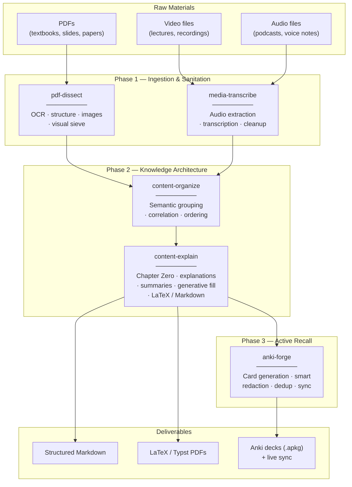
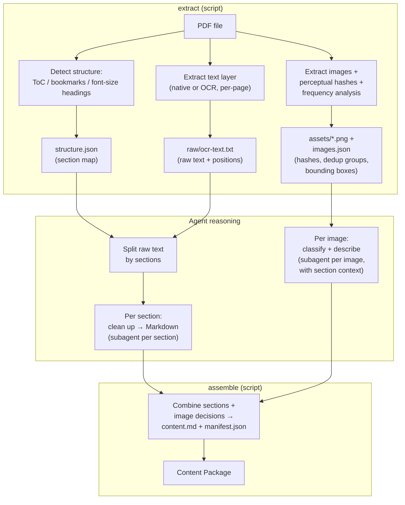
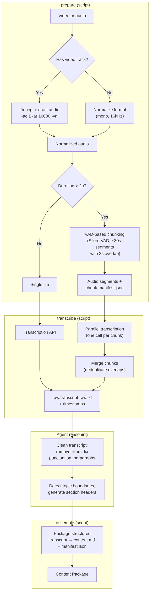
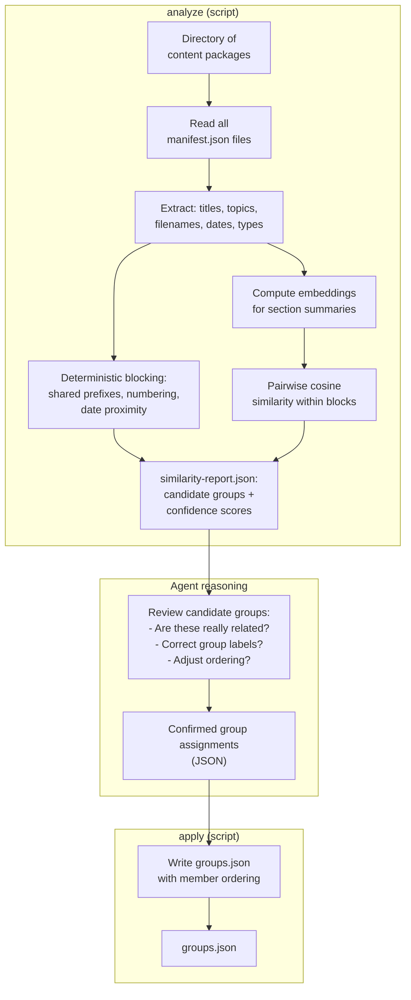
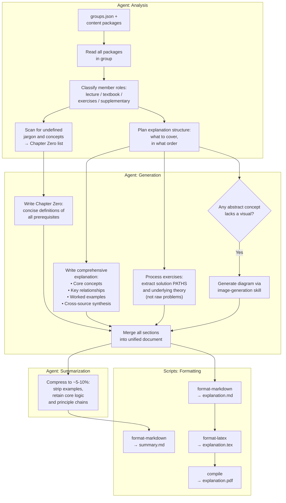
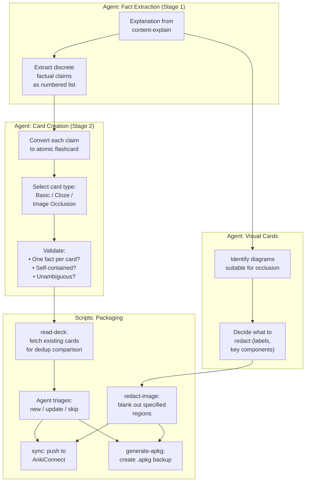
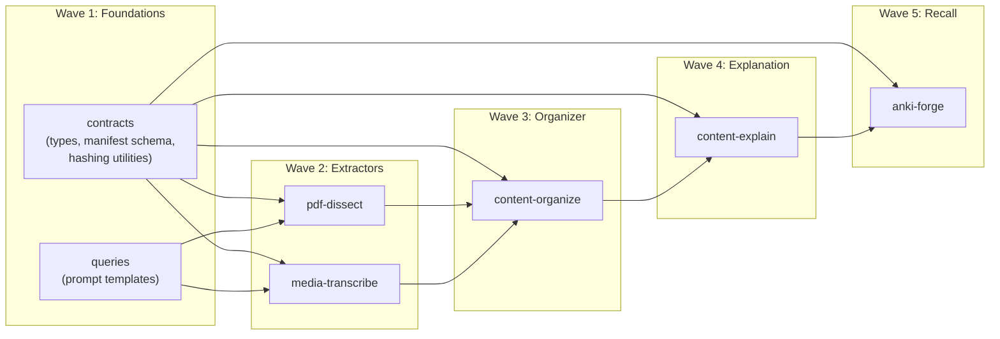

# Agentic Athenaeum — Skill Architecture Plan

> **Vision**: Turn a chaotic pile of study materials — PDFs, lecture recordings,
> exercise sheets — into structured explanations, polished summaries, and
> spaced-repetition flashcards. The human role shifts from _preparation_ to
> _mastery_.

---

## 1. Core Design Principle: Scripts are Hands, the Agent is the Brain

Agent skills in this repository are **tools an AI agent wields**, not
autonomous pipelines. Understanding this split is essential to every design
decision below.

| Layer | Responsibility | Examples |
|-------|---------------|----------|
| **Action scripts** (Node.js) | Mechanical, repeatable, format-preserving work | Extract text from PDF, compute image hashes, call transcription API, write LaTeX, push cards to AnkiConnect |
| **The invoking agent** (LLM) | Creative, context-sensitive reasoning | Clean up messy OCR, classify an image as "content" vs "noise", write an explanation, generate flashcard wording |
| **SKILL.md + references/** | Contract between the two | Tells the agent what actions exist, what inputs/outputs look like, and what strategies to follow |

**Why this matters:** A script that tries to "clean up text" internally would
need its own LLM calls, its own API key management, its own prompt engineering
— duplicating what the agent already does natively. Instead, the script extracts
raw text; the agent cleans it; a second script assembles the cleaned output.
Each layer does what it is best at.

This means every skill follows a **three-beat rhythm**:

```
1. EXTRACT  →  script produces raw materials
2. THINK    →  agent reasons over them (classify, clean, explain, generate)
3. ASSEMBLE →  script packages the agent's decisions into final output
```

---

## 2. Pipeline Overview



### Five Skills, Three Phases

| # | Skill | Phase | Purpose |
|---|-------|-------|---------|
| 1 | **`pdf-dissect`** | Ingestion | Extract text + images from PDFs, detect structure, sieve visual noise |
| 2 | **`media-transcribe`** | Ingestion | Extract audio from video, transcribe, produce structured transcript |
| 3 | **`content-organize`** | Architecture | Group related materials, detect correlations, order logically |
| 4 | **`content-explain`** | Architecture | Generate explanations, summaries, Chapter Zero, polished output |
| 5 | **`anki-forge`** | Recall | Create atomic flashcards, smart redaction, sync to Anki |

**No orchestrator skill.** The AI agent IS the orchestrator — it reads each
skill's SKILL.md, understands what actions are available, and chains them as
needed. A "meta-skill" that calls other skills would duplicate the agent's
native capability and add fragile coupling.

---

## 3. Content Package — The Universal Interface

Every ingestion skill outputs a **Content Package**: a flat directory with a
strict contract. Downstream skills never need to know whether content came from
a PDF or a lecture recording.

```
<source-name>/
├── content.md                   # Structured Markdown (primary artifact)
├── manifest.json                # Metadata, sections, image index, provenance
├── assets/
│   ├── img-001.png
│   └── ...
└── raw/                         # Preserved originals for re-processing
    ├── ocr-text.txt             # (pdf-dissect only)
    └── transcript-raw.txt       # (media-transcribe only)
```

### manifest.json

Incorporates Oracle review feedback: typed locators, provenance tracking,
processing status, confidence scores, and content-addressable IDs.

```jsonc
{
  // ── Identity ──
  "package_id": "pkg_a1b2c3",                  // Deterministic hash of source file
  "source_file": "lecture-03.pdf",
  "source_sha256": "e3b0c44298fc...",           // Content-addressable source ID
  "source_type": "pdf",                         // "pdf" | "video" | "audio"
  "title": "Chapter 3: Neural Networks",
  "processing_version": "1.0.0",
  "created_at": "2026-02-10T15:00:00Z",

  // ── Processing status ──
  "status": "complete",                         // "complete" | "partial" | "failed"
  "errors": [],                                 // Errors that prevented processing
  "warnings": [                                 // Non-fatal issues
    "Page 17: OCR confidence below 60%, manual review recommended"
  ],
  "provenance": {
    "processor": "pdf-dissect@1.0.0",
    "model_used": "tesseract-5.3",              // Or "gpt-4o" for image analysis, etc.
    "processed_at": "2026-02-10T15:02:30Z"
  },

  // ── Structure ──
  "sections": [
    {
      "id": "sec-01",
      "title": "Introduction",
      "level": 1,
      "locator": {                              // Typed — not overloaded page_range
        "type": "page",                         // "page" | "time_ms"
        "start": 1,
        "end": 5
      },
      "confidence": 0.95,
      "summary": "Overview of neural network architectures and history"
    }
  ],

  // ── Images ──
  "images": [
    {
      "id": "img-001",
      "file": "assets/img-001.png",
      "sha256": "d7a8fbb307...",                // Content-addressable
      "locator": { "type": "page", "start": 3, "end": 3 },
      "classification": "diagram",              // Agent-assigned
      "description": "Encoder-decoder architecture with attention mechanism",
      "relevance": "content",                   // "content" | "noise" | "unclassified"
      "better_as_text": false,
      "text_replacement": null,                 // Set when better_as_text is true
      "duplicate_of": null                      // img ID if this is a recurring element
    }
  ],

  // ── Document metadata ──
  "metadata": {
    "language": "en",
    "page_count": 42,
    "word_count": 12500,
    "has_toc": true,
    "has_native_text": true,                    // false = fully scanned / image-only
    "duration_seconds": null,                   // For media
    "detected_topics": ["neural networks", "attention", "backpropagation"]
  }
}
```

**Design decisions** (addressing Oracle critique):

| Concern | Solution |
|---------|----------|
| Overloaded `page_range` for PDF vs media | Typed `locator` object with `type: "page" \| "time_ms"` |
| No way to trace processing lineage | `provenance` block with processor version, model, timestamp |
| Partial failures propagate silently | `status` + `errors[]` + `warnings[]`; downstream skills check `status` before processing |
| No stable identity across re-runs | `package_id` derived from `source_sha256`; `image.sha256` for content-addressable assets |
| Confidence unknown | Per-section and per-image `confidence` scores |

---

## 4. Skill Specifications

### 4.1 `pdf-dissect` — PDF Extraction & Visual Sieve

> Strip a PDF down to its atoms: structured text, classified images, and a
> manifest that tells downstream skills exactly what they're working with.

#### Actions

| Action | Input | Output | Deterministic? |
|--------|-------|--------|----------------|
| `extract` | PDF file path | Raw text (with positions), extracted images (with hashes + dedup), structure hints (ToC/headings), `raw/ocr-text.txt` | Yes |
| `assemble` | Cleaned section Markdown (from agent) + image classification decisions (from agent) + raw extraction output | Final `content.md` + `manifest.json` + `assets/` | Yes |

#### Agent Workflow (guided by SKILL.md + references/)



#### Structure Detection Strategy

The `extract` script detects document structure through a priority cascade:

| Priority | Source | How |
|----------|--------|-----|
| 1 | PDF bookmarks / outlines | Parse `/Outlines` dictionary from PDF metadata |
| 2 | Font-size heuristics | `page.get_text("dict")` returns font size per span → cluster into heading tiers (H1 > H2 > H3) |
| 3 | Page-break fallback | No headings found → split every 5–10 pages for manageable chunks |

#### Image Extraction & Visual Sieve

The `extract` script handles mechanical deduplication; the agent handles
semantic classification.

**Script responsibilities (mechanical):**

| Step | Technique | Purpose |
|------|-----------|---------|
| Extract | `page.get_images()` (PyMuPDF) | Pull all embedded images with page + bounding box |
| Hash | Perceptual hashing (dHash) | Visual fingerprint, not byte-level — catches recompressed duplicates |
| Dedup | Hamming distance ≤ 5 | Group visually identical images |
| Frequency | Appears on >30% of pages | Flag as recurring (likely header/footer/watermark) |
| Overlap | Bounding box intersection | Detect layered composites on same page |

**Agent responsibilities (semantic):**

For each unique, non-recurring image, the agent receives:

- The image file
- Surrounding text (±500 chars from image position in raw text)
- Document-level context (title + ToC summary)

The agent classifies and returns:

```jsonc
{
  "classification": "diagram",     // "diagram" | "chart" | "photo" |
                                    // "text-as-image" | "formula" | "decorative"
  "relevance": "content",          // "content" | "noise"
  "description": "Encoder-decoder architecture with multi-head attention",
  "better_as_text": false,
  "text_replacement": null          // If better_as_text, the text equivalent
}
```

| Classification | Agent action |
|---------------|-------------|
| `diagram` / `chart` | Keep — high information density, embed in output |
| `photo` | Keep if relevant to content, discard if decorative |
| `text-as-image` | Replace with `text_replacement` in final Markdown |
| `formula` | Convert to LaTeX notation (`$...$`) if possible |
| `decorative` | Discard — logos, borders, clip art |

#### OCR Layer Detection

The `extract` script checks per page:

1. Does `/Font` exist in page resources? → native text present
2. Does `page.get_text()` return <50 chars while images cover >80% of page area? → scanned
3. Mixed PDFs (some native, some scanned) are handled per-page automatically

#### Environment Variables

```yaml
metadata:
  env:
    - name: TESSERACT_PATH
      required: false
      description: Path to tesseract binary (defaults to system PATH)
```

---

### 4.2 `media-transcribe` — Audio/Video to Structured Text

> Extract audio, transcribe it, and produce a content package with structured,
> topic-segmented text — ready for explanation and flashcard generation.

#### Actions

| Action | Input | Output | Deterministic? |
|--------|-------|--------|----------------|
| `prepare` | Video or audio file path | Normalized audio file (mono, 16kHz, WAV/FLAC) + chunk manifest if file is long | Yes |
| `transcribe` | Audio file (or chunk) path | Raw transcript with word-level timestamps | Yes (for same provider) |
| `assemble` | Cleaned + structured transcript (from agent) + section decisions (from agent) | Final `content.md` + `manifest.json` | Yes |

#### Agent Workflow



#### Technical Decisions

| Concern | Decision | Rationale |
|---------|----------|-----------|
| Audio format | Mono, 16 kHz, WAV or FLAC | 16 kHz is the standard for speech models. Mono halves file size with no speech quality loss. FLAC for lossless compression when storage matters. |
| ffmpeg command | `ffmpeg -i input.mp4 -ac 1 -ar 16000 -vn output.wav` | `-ac 1` mono, `-ar 16000` sample rate, `-vn` strip video |
| Chunking | VAD-based silence detection (Silero VAD) | Silero outperforms WebRTC VAD on accuracy. 30s target aligns with Whisper's native window. 2s overlap prevents boundary word loss. |
| Chunk merging | String similarity at boundaries | Overlapping chunks produce duplicate text — fuzzy match at overlap regions to deduplicate |
| Transcription provider | Provider-agnostic interface | Script accepts a `--provider` flag. Provider adapters are internal. User configures via env vars. |

#### Agent Cleanup Strategy

The agent receives the raw transcript and applies:

1. **Filler removal**: "um", "uh", "like", "you know", coughing, repetitions
2. **Punctuation repair**: Add sentence boundaries, commas, question marks
3. **Paragraph segmentation**: Break at natural topic/thought boundaries
4. **Topic detection**: Identify where the speaker shifts subjects
5. **Header generation**: Create descriptive section titles for each topic segment

For long transcripts, the agent processes in sliding windows (~2000 tokens)
with overlap to maintain context at boundaries.

#### Environment Variables

```yaml
metadata:
  env:
    - name: TRANSCRIPTION_PROVIDER
      required: true
      description: "Transcription backend: 'whisper-local' | 'openai' | 'deepgram' | 'assemblyai'"
    - name: TRANSCRIPTION_API_KEY
      required: false
      description: API key for cloud transcription (not needed for whisper-local)
    - name: FFMPEG_PATH
      required: false
      description: Path to ffmpeg binary (defaults to system PATH)
```

---

### 4.3 `content-organize` — Material Grouping & Correlation

> Given a collection of content packages, detect which materials belong together
> (e.g., a lecture's slides + recording + exercises) and order them logically
> within each group.

#### Actions

| Action | Input | Output | Deterministic? |
|--------|-------|--------|----------------|
| `analyze` | Directory of content packages | Similarity report: pairwise scores, metadata matches, suggested groups with confidence | Yes (for same embedding model) |
| `apply` | Agent-confirmed group assignments | `groups.json` manifest | Yes |

#### Agent Workflow



#### Grouping Strategy (Layered, Addressing Oracle Critique)

Oracle flagged that pure semantic similarity drifts on repetitive semester
content. The solution is **deterministic blocking first**, then similarity
reranking within blocks, then agent review for low-confidence results.

| Layer | Signal | Weight | Example |
|-------|--------|--------|---------|
| 1. **Deterministic blocking** | Shared filename prefixes, numbering schemes (`lecture-03`, `ex-03`) | Highest | `lecture-03.pdf` + `lecture-03-slides.pdf` → same block |
| 2. **Date proximity** | Files created/modified within same week | High | Materials from the same class session |
| 3. **Semantic similarity** | Cosine similarity of summary embeddings > 0.7 within blocks | Medium | Transcript about "attention" + PDF about "transformers" |
| 4. **Explicit references** | One document mentions another by name | Very High | Slides say "see textbook chapter 5" |
| 5. **Type complementarity** | Lecture + slides + exercises = natural group | Medium | Different formats covering same topic |

**Why blocking matters:** Computing full pairwise similarity across 50+ packages
is O(n²) and produces false matches when topics overlap (e.g., every ML lecture
mentions "gradient descent"). Blocking by filename/date first reduces comparison
space dramatically and improves precision.

#### Group Manifest Output (`groups.json`)

```jsonc
{
  "groups": [
    {
      "id": "group-01",
      "label": "Lecture 3: Neural Networks",
      "confidence": 0.92,
      "members": [
        { "package_id": "pkg_a1b2c3", "path": "lecture-03-slides/", "role": "slides" },
        { "package_id": "pkg_d4e5f6", "path": "lecture-03-recording/", "role": "lecture" },
        { "package_id": "pkg_g7h8i9", "path": "exercise-03/", "role": "exercises" },
        { "package_id": "pkg_j0k1l2", "path": "textbook-ch05/", "role": "reference" }
      ],
      "suggested_order": ["textbook-ch05", "lecture-03-slides", "lecture-03-recording", "exercise-03"]
    }
  ],
  "ungrouped": [
    { "package_id": "pkg_m3n4o5", "path": "random-notes/", "reason": "No strong correlation found" }
  ]
}
```

#### Environment Variables

```yaml
metadata:
  env:
    - name: EMBEDDING_PROVIDER
      required: true
      description: "Embedding backend for similarity: 'openai' | 'local'"
    - name: EMBEDDING_API_KEY
      required: false
      description: API key for cloud embeddings (not needed for local)
```

---

### 4.4 `content-explain` — Knowledge Architecture & Study Materials

> The intellectual core of the pipeline. Takes grouped content packages and
> produces structured explanations, prerequisite definitions (Chapter Zero),
> summaries, and polished output in Markdown or LaTeX/Typst.

This skill has the richest agent involvement — the scripts mostly handle
formatting and compilation, while the agent does the heavy intellectual work.

#### Actions

| Action | Input | Output | Deterministic? |
|--------|-------|--------|----------------|
| `format-markdown` | Agent-written explanation text + image references | Clean, standards-compliant Markdown with embedded images, callouts, math notation | Yes |
| `format-latex` | Markdown source + template choice | LaTeX or Typst document ready for compilation | Yes |
| `compile` | LaTeX/Typst source file | Compiled PDF | Yes |

#### Agent Workflow



#### Chapter Zero — Prerequisite Detection

One of the most valuable features. The agent scans all content in a group for:

- Terms used but never defined in the material
- Concepts referenced that assume prior knowledge
- Notation introduced without explanation

It produces a **Chapter Zero** section at the top of the explanation with
concise, self-contained definitions. This ensures the reader is never lost,
even if they skipped earlier lectures.

**Example:**

```markdown
## Chapter 0: Prerequisites

Before diving in, make sure you're comfortable with these concepts:

- **Gradient**: The vector of partial derivatives of a function. Points in the
  direction of steepest increase. (Referenced in §2.1, §3.4)
- **Softmax**: A function that converts a vector of real numbers into a
  probability distribution. $\sigma(z_i) = \frac{e^{z_i}}{\sum_j e^{z_j}}$
  (Referenced in §1.3)
- **Cross-entropy loss**: Measures the difference between two probability
  distributions. (Referenced in §2.2)
```

#### Generative Fill — AI-Created Diagrams

When the agent identifies an abstract concept that would benefit from a visual
but no image exists in the source material, it can invoke the project's
`image-generation` skill to create one.

**When to trigger:**

- Concept has no associated diagram in the source
- Concept involves spatial/structural relationships (architectures, flows, hierarchies)
- A diagram would reduce explanation length by >30%

**Process:**

1. Agent describes the desired diagram in natural language
2. Agent calls `image-generation` skill to produce the image
3. Generated image is saved to `assets/` with `provenance.model = "generated"`
4. Image is embedded in the explanation with a `[Generated diagram]` caption

#### Exercise Handling

The agent does NOT dump raw problem statements into the explanation. Instead:

| Source | What goes in the explanation |
|--------|-----------------------------|
| Problem statement | Brief reference ("Exercise 3 asks you to implement...") |
| Solution path | Step-by-step reasoning approach, with theory references |
| Underlying theory | The concept being tested and WHY this approach works |
| Common mistakes | What students typically get wrong and why |

This ensures the explanation teaches the THINKING, not just the answers.

#### Output Modes

##### Basic — Markdown

Every explanation produces Markdown as the baseline. Features:

- Heading hierarchy matching content structure
- Embedded images via relative paths ``
- Math notation via `$...$` (MathJax/KaTeX compatible)
- Fenced code blocks with language tags
- Callout blocks for definitions, warnings, key insights:

  ```markdown
  > **Definition:** A *transformer* is...

  > **⚠ Common Mistake:** Don't confuse attention weights with...
  ```

##### Polished — LaTeX or Typst

For high-quality printed study materials. The `format-latex` action converts
Markdown to LaTeX or Typst, applying educational templates.

| Aspect | LaTeX | Typst |
|--------|-------|-------|
| Compilation speed | Seconds | 6–10x faster |
| Math support | Gold standard | Very good |
| Ecosystem | Mature (tcolorbox, minted, geometry) | Young, growing fast |
| Recommended for | Final polished output | Iterative drafts |

**LaTeX packages used:**

- `geometry` — margin optimization for dense study guides
- `tcolorbox` — styled blocks for definitions, theorems, examples, warnings
- `minted` / `listings` — syntax-highlighted code
- `amsmath` / `mathtools` — mathematical typesetting
- `hyperref` — cross-references with `\ref` and `\label`
- Sans-serif font (Source Sans Pro) — better legibility at small sizes

**Conversion:** Markdown → Pandoc → LaTeX/Typst → PDF

#### Environment Variables

```yaml
metadata:
  env:
    - name: LATEX_ENGINE
      required: false
      description: "LaTeX compiler: 'pdflatex' | 'xelatex' | 'lualatex' (default: xelatex)"
    - name: TYPST_PATH
      required: false
      description: Path to typst binary (if using Typst output)
```

---

### 4.5 `anki-forge` — Flashcard Generation, Smart Redaction & Sync

> Generate high-quality, atomic Anki flashcards from explanations. Supports
> smart image redaction for visual recall cards. Syncs to Anki via AnkiConnect
> or exports .apkg files.

#### Actions

| Action | Input | Output | Deterministic? |
|--------|-------|--------|----------------|
| `read-deck` | Deck name or tag filter | JSON dump of existing cards (for dedup) | Yes |
| `generate-apkg` | Card data JSON (from agent) + media files | `.apkg` file ready for Anki import | Yes |
| `sync` | Card data JSON (from agent) | Sync report: created / updated / skipped counts | Yes (idempotent) |
| `redact-image` | Image file + redaction regions (from agent) | Redacted image with blanked-out labels/regions | Yes |

#### Agent Workflow



#### Two-Stage Card Generation

Research shows single-pass "generate flashcards" produces verbose, unfocused
cards. The **two-stage extraction** pattern produces dramatically better results:

**Stage 1 — Fact Extraction** (agent extracts atomic claims):

```
Input: "The transformer uses multi-head attention to process
        sequences in parallel, unlike RNNs which process sequentially."

Claims:
1. Transformers use multi-head attention
2. Transformers process sequences in parallel
3. RNNs process sequences sequentially
4. Parallel processing differentiates transformers from RNNs
```

**Stage 2 — Card Creation** (agent converts each claim to a card):

```
Card (Basic):
  Front: "How do transformers process sequences, unlike RNNs?"
  Back:  "In parallel (via multi-head attention), vs RNNs sequentially"

Card (Cloze):
  Text: "Transformers use {{c1::multi-head attention}} to process
         sequences {{c2::in parallel}}, unlike RNNs."
```

#### Card Type Selection Guide

| Content type | Best card type | Example |
|-------------|---------------|---------|
| Definitions | **Basic** | "What is backpropagation?" → "An algorithm for..." |
| Processes / ordered lists | **Cloze** | "Steps: {{c1::compute loss}}, {{c2::compute gradients}}, {{c3::update weights}}" |
| Formulas | **Basic + MathJax** | Front: "Binary cross-entropy?" Back: `$-[y\log(\hat{y}) + (1-y)\log(1-\hat{y})]$` |
| Diagrams | **Image Occlusion** | Architecture diagram with key components blanked |
| Code | **Cloze + code block** | `` `def forward(self, x): return {{c1::self.activation}}(self.linear(x))` `` |
| Comparisons | **Basic** | "Transformer vs RNN: processing?" → "Parallel vs Sequential" |
| Language vocab | **Basic + audio** | Front: word + IPA. Back: definition + example sentence + synthesized audio |

#### Smart Redaction — Image Occlusion Cards

The `redact-image` action takes an image and a list of rectangular regions to
blank out. The agent decides WHAT to redact based on the image's description
and educational value:

```jsonc
// Agent sends this to redact-image action
{
  "source_image": "assets/img-003.png",
  "redactions": [
    { "x": 120, "y": 45, "width": 80, "height": 20, "label": "Encoder" },
    { "x": 300, "y": 45, "width": 80, "height": 20, "label": "Decoder" }
  ]
}

// Script produces: redacted image + one card per redacted region
// Card front: "What component goes here?" + redacted image
// Card back: "Encoder" + original image
```

**When to use image occlusion:**

- Labeled diagrams (architecture, anatomy, circuits)
- Process flows with named steps
- Maps with labeled regions
- Any visual where spatial relationships matter

#### Deduplication Strategy

| Method | Purpose |
|--------|---------|
| **First-field hash** | Deterministic ID from card front text. Anki uses first field for uniqueness on import. |
| **Semantic similarity** | Agent checks if a new card tests the same fact as an existing one (different wording). Embedding similarity > 0.85 = probable duplicate. |
| **Source tagging** | Every card tagged with `Source:<package-id>`, `AI_Generated`, `Generated:<date>`. Re-runs identify and update their own cards. |

#### Deck Organization

```
Course Name::
├── Module 01: Foundations::
│   ├── Linear Algebra
│   └── Probability
├── Module 02: Neural Networks::
│   ├── Perceptrons
│   └── Backpropagation
└── Module 03: Transformers::
    ├── Attention Mechanism
    └── Multi-Head Attention
```

Uses Anki's `::` separator for hierarchical decks. Tags for cross-cutting
concerns (`Source:lecture-03`, `Difficulty:hard`, `AI_Generated`).

#### AnkiConnect Integration

| Operation | Endpoint | Notes |
|-----------|----------|-------|
| Read cards | `findNotes` + `notesInfo` | Query by deck/tag |
| Create | `addNote` | deckName, modelName, fields, tags |
| Update | `updateNoteFields` | Update by note ID |
| Create deck | `createDeck` | Uses `::` for hierarchy |
| Store media | `storeMediaFile` | For image occlusion images |

**Fallback:** When AnkiConnect is unavailable (Anki not running), the
`generate-apkg` action always produces a `.apkg` backup file for manual import.

#### Environment Variables

```yaml
metadata:
  env:
    - name: ANKI_CONNECT_URL
      required: false
      description: "AnkiConnect endpoint (default: http://localhost:8765)"
    - name: ANKI_CONNECT_KEY
      required: false
      description: AnkiConnect API key (if configured)
```

---

## 5. Shared Packages

### `@agentic-athenaeum/contracts`

Types and utilities shared across all skill scripts. Bundled into each action
at build time — no runtime dependency.

**Current exports (extend as skills are built):**

| Export | Purpose |
|--------|---------|
| `loadEnv()` | Load `.env` files (local then global) |
| `normalizeInputText()` | Input sanitization |
| `ContentPackageManifest` | TypeScript type for `manifest.json` |
| `GroupManifest` | TypeScript type for `groups.json` |
| `ImageClassification` | Enum: `diagram \| chart \| photo \| text-as-image \| formula \| decorative` |
| `ImageRelevance` | Enum: `content \| noise \| unclassified` |
| `Locator` | Type: `{ type: "page" \| "time_ms", start: number, end: number }` |
| `AnkiCard` | TypeScript type for card data passed to anki-forge actions |
| `readManifest()` / `writeManifest()` | Safe manifest I/O with schema validation |
| `hashFile()` | SHA-256 of a file for content-addressable IDs |
| `perceptualHash()` | dHash computation for image dedup |

### `@agentic-athenaeum/queries`

Prompt templates and strategy guides referenced by the agent via `references/`
documents in each skill.

| Export | Used by |
|--------|---------|
| `sectionCleanupPrompt` | Agent (via references/) — cleaning raw OCR text |
| `imageClassificationPrompt` | Agent (via references/) — classifying extracted images |
| `transcriptCleanupPrompt` | Agent (via references/) — cleaning raw transcripts |
| `topicSegmentationPrompt` | Agent (via references/) — detecting topic shifts |
| `factExtractionPrompt` | Agent (via references/) — Stage 1 of card generation |
| `cardCreationPrompt` | Agent (via references/) — Stage 2 of card generation |
| `prerequisiteDetectionPrompt` | Agent (via references/) — Chapter Zero generation |
| `exerciseAnalysisPrompt` | Agent (via references/) — extracting solution paths |

---

## 6. Dependency Graph & Implementation Order



### Build Order

| Wave | What | Why this order | Complexity |
|------|------|---------------|------------|
| **1** | `contracts` types + `queries` templates | Everything imports from these. Define the Content Package schema, manifest types, card types. | Low |
| **2a** | `pdf-dissect` | Most complex extraction skill. Start early. | High |
| **2b** | `media-transcribe` | Independent of PDF — develop in parallel. | Medium |
| **3** | `content-organize` | Needs content packages to exist for testing. | Medium |
| **4** | `content-explain` | Needs grouped content. Includes Chapter Zero, Generative Fill. | Medium-High |
| **5** | `anki-forge` | Needs explanations, but card generation logic can be unit-tested independently. Smart Redaction adds complexity. | Medium |

**Note on Wave 4 → 5 dependency:** Oracle correctly flagged that `anki-forge`
depends on `content-explain` output — they are NOT parallel. The agent must
generate explanations before creating cards from them.

---

## 7. Testing Strategy

Following the repository's three-tier test structure:

| Level | What | Example |
|-------|------|---------|
| **Unit** (`*.unit.test.ts`) | Pure functions, type validation, hashing, formatting | `perceptualHash()` returns consistent hash for same image |
| **Integration** (`*.integration.test.ts`) | Built scripts run and produce valid output | `node pdf-dissect/scripts/extract.js --input fixture.pdf` exits 0 and outputs valid manifest |
| **E2E** (`*.e2e.test.ts`) | Full skill layout exists and scripts execute correctly | `skills/pdf-dissect/` has SKILL.md, scripts/, references/ |

### Test Fixtures (`tests/fixtures/`)

| Fixture | Used by |
|---------|---------|
| `sample-textbook.pdf` | pdf-dissect (multi-page, has ToC, images, formulas) |
| `sample-scanned.pdf` | pdf-dissect (image-only, needs OCR) |
| `sample-slides.pdf` | pdf-dissect (slide deck, recurring headers/logos) |
| `sample-audio.wav` | media-transcribe (short clip for transcription testing) |
| `sample-manifest.json` | content-organize, content-explain (valid manifest for downstream testing) |
| `sample-cards.json` | anki-forge (card data for .apkg generation testing) |

---

## 8. `dev/` Directory Layout (All Skills)

```
dev/
├── pdf-dissect/
│   ├── SKILL.dev.md
│   ├── scripts/
│   │   ├── extract.ts
│   │   └── assemble.ts
│   ├── __tests__/
│   │   ├── extract.unit.test.ts
│   │   ├── extract.integration.test.ts
│   │   └── assemble.e2e.test.ts
│   ├── references/
│   │   ├── REFERENCE.md              # Output format specification
│   │   ├── image-classification.md    # Guide for agent: how to classify images
│   │   └── section-cleanup.md         # Guide for agent: how to clean OCR text
│   └── assets/
│
├── media-transcribe/
│   ├── SKILL.dev.md
│   ├── scripts/
│   │   ├── prepare.ts
│   │   ├── transcribe.ts
│   │   └── assemble.ts
│   ├── __tests__/
│   ├── references/
│   │   ├── REFERENCE.md
│   │   └── transcript-cleanup.md      # Guide for agent
│   └── assets/
│
├── content-organize/
│   ├── SKILL.dev.md
│   ├── scripts/
│   │   ├── analyze.ts
│   │   └── apply.ts
│   ├── __tests__/
│   ├── references/
│   │   └── REFERENCE.md
│   └── assets/
│
├── content-explain/
│   ├── SKILL.dev.md
│   ├── scripts/
│   │   ├── format-markdown.ts
│   │   ├── format-latex.ts
│   │   └── compile.ts
│   ├── __tests__/
│   ├── references/
│   │   ├── REFERENCE.md
│   │   ├── chapter-zero.md            # Guide: prerequisite detection strategy
│   │   ├── exercise-handling.md        # Guide: solution paths, not raw problems
│   │   └── explanation-structure.md    # Guide: progressive depth, cross-referencing
│   └── assets/
│       ├── template-study-guide.tex
│       └── template-summary.typ
│
├── anki-forge/
│   ├── SKILL.dev.md
│   ├── scripts/
│   │   ├── read-deck.ts
│   │   ├── generate-apkg.ts
│   │   ├── sync.ts
│   │   └── redact-image.ts
│   ├── __tests__/
│   ├── references/
│   │   ├── REFERENCE.md
│   │   ├── card-quality.md            # Guide: minimum information principle
│   │   └── two-stage-extraction.md    # Guide: fact extraction → card creation
│   └── assets/
│
packages/
├── contracts/
│   └── src/
│       ├── index.ts
│       ├── env.ts
│       ├── manifest.ts                # ContentPackageManifest type + validation
│       ├── groups.ts                  # GroupManifest type
│       ├── cards.ts                   # AnkiCard type
│       ├── hashing.ts                 # SHA-256, perceptual hash utilities
│       └── locator.ts                 # Typed locator for page/time references
└── queries/
    └── src/
        ├── index.ts
        ├── cleanup-prompts.ts
        ├── classification-prompts.ts
        ├── explanation-prompts.ts
        └── card-prompts.ts
```

---

## 9. Future Extensions (Not in Scope Now)

Ideas to consider after the core five skills are stable:

| Extension | Description | Depends on |
|-----------|-------------|------------|
| **PPT/PPTX/Keynote import** | Convert slide decks to PDF first, then run `pdf-dissect` | pdf-dissect |
| **EPUB/DOCX import** | Convert to Markdown directly, skip PDF extraction | content-explain |
| **Jupyter notebook import** | Extract code cells + markdown + outputs | pdf-dissect (for rendered outputs) |
| **Multi-language support** | Language detection + per-language cleanup prompts | All skills (queries package) |
| **Advanced linguistics** | IPA pronunciation, audio synthesis, contextual example sentences for language learning cards | anki-forge |
| **Study session generator** | Practice quizzes, timed review sessions, spaced repetition scheduling | anki-forge + content-explain |
| **Progress dashboard** | Track what's been processed, card retention rates, study time | All skills (new skill) |

---

## 10. Open Design Questions

| # | Question | Options | Current Leaning |
|---|----------|---------|----------------|
| 1 | **Should scripts make LLM calls internally?** | (a) Scripts are purely mechanical, agent does all LLM work (b) Scripts can call LLMs for well-defined tasks | (a) — cleaner separation, but (b) may be needed for transcription cleanup at scale |
| 2 | **Image extraction: Python (PyMuPDF) or Node?** | (a) Python subprocess from Node script (b) Node PDF library (pdf-lib, pdf.js) (c) Shell out to external tool | (a) — PyMuPDF is vastly superior for image extraction; Node PDF libs lack this capability |
| 3 | **Transcription chunking in script or externally?** | (a) Script handles chunking + API calls (b) Script only prepares audio, agent manages API calls | (a) — chunking is mechanical, shouldn't burden the agent |
| 4 | **Perceptual hashing: Node implementation or Python?** | (a) Port dHash to TypeScript (simple algorithm) (b) Shell out to Python imagededup | (a) — dHash is ~20 lines of code, no need for Python dependency |
| 5 | **`.apkg` generation: Node or Python (genanki)?** | (a) Pure Node implementation of .apkg format (SQLite + zip) (b) Shell out to genanki Python | (a) — .apkg is well-documented SQLite schema, avoidable Python dependency |
| 6 | **Should `content-organize` be a script or just agent logic?** | (a) Script computes embeddings + similarity (b) Agent does it all by reading manifests | (a) — embedding computation is mechanical and benefits from batch API calls |
| 7 | **LaTeX templates: bundled or user-provided?** | (a) Ship defaults in assets/, allow override (b) Always require user templates | (a) — good defaults with escape hatch |
| 8 | **Should `groups.json` be editable by the user before `content-explain` runs?** | (a) Yes, always pause for review (b) Auto-proceed above confidence threshold | (a) for first version — grouping errors are expensive to fix downstream |

---

## 11. Glossary

| Term | Definition |
|------|-----------|
| **Content Package** | Standardized directory (`content.md` + `manifest.json` + `assets/`) output by extraction skills |
| **Manifest** | JSON file describing a Content Package's metadata, sections, images, processing status |
| **Visual Sieve** | The process of classifying images as "content" vs "noise" and discarding noise |
| **Chapter Zero** | Auto-generated prerequisite definitions for concepts used but not explained in the source |
| **Generative Fill** | Using image generation AI to create diagrams for concepts that lack visuals |
| **Smart Redaction** | Blanking out labels/regions in diagrams to create "fill in the blank" visual flashcards |
| **Two-stage extraction** | Fact extraction → card creation (vs single-pass generation) for higher quality cards |
| **Perceptual hash** | Image fingerprint that is similar for visually similar images (unlike cryptographic hashes) |
| **VAD** | Voice Activity Detection — detecting speech vs silence in audio for intelligent chunking |
| **AnkiConnect** | Anki plugin exposing a REST API on localhost:8765 for programmatic card management |
| **Minimum Information Principle** | Each flashcard should test exactly one atomic fact |
| **Deterministic blocking** | Grouping candidates by metadata (filenames, dates) before computing expensive similarity |
| **Content group** | A collection of related Content Packages (e.g., lecture slides + recording + exercises) |
| **Locator** | Typed reference to a position in source material (`{type: "page", start, end}` or `{type: "time_ms", ...}`) |
